# 게슈탈트 시지각 원리 → UI/UX 적용 레퍼런스

> **목적** — 게슈탈트 시지각 이론을 깊게 이해하고, 그 원리를 화면 설계(레이아웃·그룹핑·시각 위계)에 적용하기 위한 개인 학습/작업 레퍼런스.
> **작성일** — 2026-06-10 · **버전** — v0.3 · **관리** — GitHub private repo (이미지는 `assets/`에 상대경로로 관리)
> **변경** — v0.3: 9개 법칙별 인지 원리 심화 + 카테고리별 적용 패턴(폼·내비·차트·모바일·모션) + 법칙 간 상호작용 추가 · v0.2: 메인 컬러 `#6541F2` 통일, UI/UX 예시 + 안티패턴 비교 이미지 추가

---

## 이 문서 사용법

- 각 법칙은 **정의 → 시각 예시 → 왜(인지 원리) → UI/UX 적용 → 레퍼런스 → 체크리스트**의 6블록 구조로 반복됩니다.
- 처음 볼 때는 **2장(개별 법칙)** 보다 **1장(프레그난츠)** 을 먼저 읽으면 "왜 이런 법칙들이 존재하는지" 뼈대가 잡힙니다.
- 실무 적용 감각은 **4장(케이스 스터디)** 가 핵심입니다. 한 화면엔 여러 법칙이 동시에 작동합니다.
- 빠른 리뷰용으로는 **6장(체크리스트)** 만 펼쳐 쓰세요.
- 원리 설명 다이어그램은 모두 제작본이 들어가 있습니다. 각 PNG는 편집 가능한 **`.svg` 원본**이 `assets/`에 함께 있어, Figma·일러스트레이터로 색/형태를 바로 수정할 수 있습니다.
- **3장(위계 분석)·4.5절(이벤트 페이지)** 두 곳은 본인 작업 화면이 들어갈 자리라 임시 placeholder 이미지가 들어가 있습니다. 같은 파일명(`assets/03-hierarchy-annotated.png`, `assets/04-5-event-page.png`)으로 캡처를 덮어쓰면 교체됩니다.
- 각 법칙의 **UI/UX 적용** 절에는 SVG 목업 예시와 인터랙티브 HTML 데모(`assets/examples/`)가 함께 들어 있습니다. HTML은 원시 보기(`raw.githack.com`)로 열거나 로컬에서 직접 확인할 수 있습니다.

## 목차

1. [게슈탈트 심리학 개요](#1-게슈탈트-심리학-개요)
2. [핵심 그룹핑 법칙](#2-핵심-그룹핑-법칙)
   - [2.1 근접성 Proximity](#21-근접성-proximity)
   - [2.2 유사성 Similarity](#22-유사성-similarity)
   - [2.3 공통 영역 Common Region](#23-공통-영역-common-region)
   - [2.4 연결성 Uniform Connectedness](#24-연결성-uniform-connectedness)
   - [2.5 연속성 Continuity](#25-연속성-continuity--good-continuation)
   - [2.6 폐쇄성 Closure](#26-폐쇄성-closure)
   - [2.7 전경-배경 Figure-Ground](#27-전경-배경-figureground)
   - [2.8 공동운명 Common Fate](#28-공동운명-common-fate)
   - [2.9 대칭과 질서 Symmetry / Prägnanz](#29-대칭과-질서-symmetry--prägnanz)
3. [시각 위계 Visual Hierarchy](#3-시각-위계-visual-hierarchy)
4. [화면 적용 케이스 스터디](#4-화면-적용-케이스-스터디)
5. [안티패턴 / 흔한 실수](#5-안티패턴--흔한-실수)
   - [5.1 어중간한 간격](#51-어중간한-간격)
   - [5.2 유사성 과용](#52-유사성-과용)
   - [5.3 상자 천지](#53-상자-천지)
   - [5.4 전부 강조 = 강조 없음](#54-전부-강조--강조-없음)
   - [5.5 과한 폐쇄성 / 생략](#55-과한-폐쇄성--생략)
   - [5.6 배경 위 저대비 텍스트](#56-배경-위-저대비-텍스트)
6. [실무 체크리스트](#6-실무-체크리스트)
7. [참고 자료](#7-참고-자료)
8. [부록: 용어집](#8-부록-용어집)

---

## 1. 게슈탈트 심리학 개요

**한 줄 정의** — "전체는 부분의 합과 다르다(The whole is different from the sum of its parts)." 우리 시각 시스템은 개별 요소를 따로 보지 않고, 의식하기 전에 먼저 **묶고·분리하고·완성해서** 의미 있는 구조로 지각한다.

**배경** — 1910~30년대 독일에서 막스 베르트하이머(Max Wertheimer), 쿠르트 코프카(Kurt Koffka), 볼프강 쾰러(Wolfgang Köhler)가 정립했다. "Gestalt"는 독일어로 형태·구조·전체를 뜻한다. 이들은 인간이 무질서 속에서 어떻게 질서를 찾는지를 연구했고, 그 결과가 오늘날 UI 설계의 기반이 되는 그룹핑 법칙들이다.

### 프레그난츠 법칙 (Law of Prägnanz) — 모든 법칙의 상위 원리

개별 법칙(근접성·유사성 등)을 외우기 전에 이걸 먼저 잡아야 한다. **프레그난츠(= 단순성의 법칙, the law of simplicity / minimum principle)** 는 이렇게 말한다:

> 뇌는 주어진 자극을 **가능한 한 가장 단순하고 안정적인 형태로** 조직하려 한다.

즉 개별 그룹핑 법칙들은 제각각 따로 있는 규칙이 아니라, "지각을 최대한 단순하게 만들려는" 하나의 경향이 상황별로 발현된 것이다. 근접성도, 유사성도, 폐쇄성도 결국 "이렇게 묶는 게 더 단순하니까" 일어난다.

**왜 UI/UX에서 중요한가**

- 사용자는 화면을 **읽기 전에 스캔**한다. 그 스캔 단계에서 무의식적으로 그룹을 만든다.
- 디자이너가 그룹핑 신호를 잘 주면 → 사용자의 **인지 부하**가 줄고, 의미가 빠르게 전달된다.
- 신호가 모호하면 → 뇌가 "잘못된 그룹"을 만들어 오해·이탈로 이어진다.
- 핵심: **간격·정렬·색·테두리 같은 작은 선택이 "무엇이 한 묶음인지"를 결정**한다.

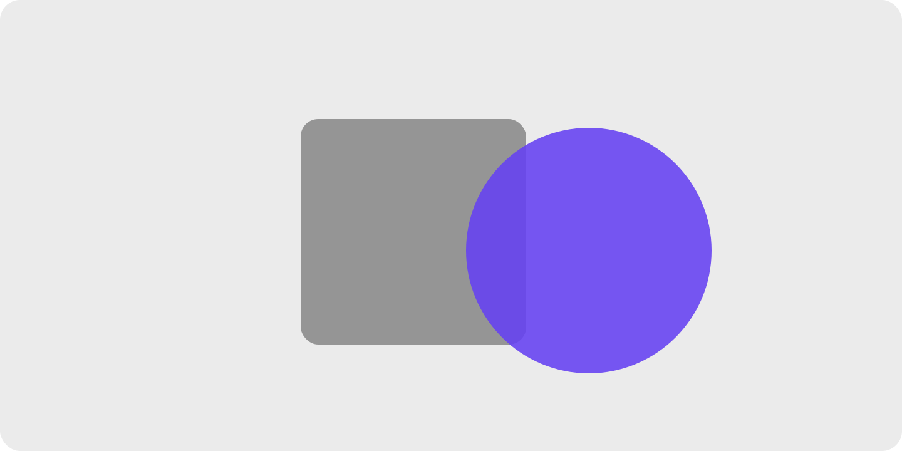
> 겹친 사각형과 원이 하나의 복잡한 윤곽이 아니라 두 개의 단순한 도형으로 분리되어 보인다 — 단순성으로 향하는 지각의 기본 경향.

---

## 2. 핵심 그룹핑 법칙

### 2.1 근접성 Proximity

**정의** — 서로 가까이 있는 요소들은 한 그룹으로 지각된다. 멀리 떨어진 요소들은 다른 역할을 하는 것으로 본다.

> 같은 점 9개를 ① 균등 배치 ② 3개씩 가깝게 배치한 두 버전. 같은 요소인데 간격만으로 묶임이 달라진다.

**왜 (인지 원리)**

- 시각 시스템은 자극 제시 후 약 **150–200ms** 안에 그룹핑을 완료한다(Han & Humphreys, 1999). 사용자가 라벨을 "읽기 전"에 이미 어느 필드 소속인지 결정된다는 뜻이다.
- 근접성은 일종의 **베이지안 사전 추정**이다. 자연계에서 공간적으로 가까운 요소는 같은 객체일 확률이 높다는 통계적 규칙성을 시각 시스템이 학습한 결과로 본다(Geisler, 2008).
- **클러스터 임계비(cluster ratio)** — 그룹 내부 간격이 그룹 사이 간격의 **약 1/2 이하**일 때 묶음이 안정적으로 지각된다. 1/2~2/3 구간은 모호, 2/3 초과면 그룹이 풀린다.
- 다른 그룹핑 단서와 충돌할 때 — 근접성은 **색·모양·크기·방향을 자주 압도**하지만, **공통 영역(테두리·배경)·연결성(명시적 선)에는 진다**(Palmer & Rock, 1994).
- 작동이 깨지는 조건: ① 그룹 내부 ≈ 그룹 사이 간격(모호), ② 회전·기울어진 텍스트(읽기 축이 우선해 시각 거리 인식이 왜곡), ③ 시선이 이미 한 곳에 고정된 상태(주변시야에서 근접성이 약화).

**현장 적용 패턴**

*폼·입력*

- 라벨 ↔ 필드: 4–8px (긴밀하게 묶임). 다음 필드 라벨까지: 16–24px. **두 간격의 비율 1:3 이상**을 만들어야 라벨이 자기 필드에 명백히 속함.
- 인라인 에러 메시지: 해당 필드 아래 ≤8px. 다음 필드 라벨보다 명백히 가까워야 "어느 필드 에러인지" 즉시 인지.
- 헬프 텍스트: 필드 아래 4px(필드의 부속물)·다음 필드까지 20px 이상. 헬프와 다음 라벨 간격 비율 1:4 이상 권장.
- 폼 섹션 헤더: 위 32–48px(섹션 분리)·아래 16–24px(자기 섹션 결합). 위:아래 비율 ≥ 2:1.
- 라디오/체크박스 그룹: 옵션 간 8px(그룹 내), 그룹 간 24px+ (그룹 사이). 옵션 라벨이 다음 그룹의 첫 옵션과 같은 거리면 시각적 그룹이 깨짐.
- 좌측 라벨(label-on-left) 폼: 라벨-필드 수평 간격이 행간보다 좁아야 함. 행간보다 넓으면 라벨이 위 행 필드로 묶임.
- multi-step 폼: 진행 인디케이터 단계 명과 단계 번호는 4px(같은 단위), 단계 사이는 32px+(시간적 순서 구분).

*카드·리스트*

- 카드 내부 패딩 16–24px < 카드 간 gap 24–32px → **테두리 없이도 그룹 형성**. 내부 패딩 > 카드 간 gap이면 카드가 한 덩어리로 보임.
- 리스트 아이템: 메타(아바타·아이콘+텍스트) 내부 8px, 아이템 사이 12–16px, 카테고리 헤더와 첫 아이템 8px.
- 그리드 카드: 가로 = 세로 간격(같은 그리드 리듬)으로 시각 무게가 안정. 가로 ≠ 세로면 한쪽으로 기울어 보임.
- 복잡한 카드(헤더 + 본문 + 푸터): 헤더-본문 16px / 본문-푸터 16px / 푸터-카드 끝 16px(내부 일관). 카드 사이는 그 두 배.

*내비게이션*

- 메뉴 그룹 헤더 ↔ 첫 항목 4–8px, 그룹 사이 16–24px. macOS Finder 사이드바·Spotify 좌측 메뉴가 대표적.
- 메가메뉴: 컬럼 간 32–48px(섹션 분리), 컬럼 내 그룹 라벨과 항목 8px. 컬럼 간격이 너무 좁으면 컬럼이 하나로 섞임.
- 하단 탭바: 아이콘 ↔ 라벨 4px(같은 단위로 묶임), 탭 사이 자동 균등. 아이콘만/라벨만으로 분리되면 안 됨.
- 브레드크럼: 항목과 구분자(/) 사이 4–6px, 항목 사이는 구분자 + 양옆 여백.

*데이터·차트*

- 차트 축 라벨 ↔ 축선: 4–6px. 차트 간격은 24–32px(그래프끼리 분리).
- 표(table): 헤더 ↔ 첫 행 8px / 행 간 4–8px(밀집형) 또는 12–16px(여유형). **그룹 행 분리**는 16–24px(시각적 sub-heading 역할).
- 범례(legend): 색상 칩 ↔ 라벨 6–8px(한 항목), 항목 간 16–24px.
- 대시보드 KPI 카드: 같은 도메인(예: 매출 관련) 끼리 가까이, 다른 도메인(트래픽 vs 매출)은 더 멀게.

*모바일·터치*

- 작은 화면에서 그룹 간격을 비례 축소하지 말 것 — **절대값(예: 16px) 유지**가 가독성 확보.
- 터치 타겟 최소 44×44pt(Apple HIG) / 48×48dp(Material) — 시각적 그룹은 좁아도 히트 영역은 보장.
- 바텀 시트: 핸들과 콘텐츠 사이 12px+. 핸들이 콘텐츠의 일부로 오해되지 않게.
- 스와이프 카드 캐러셀: 카드 가장자리에서 다음 카드 peek 24–40px (연속성 신호와 결합).

*마이크로카피·인라인 요소*

- 체크박스 ↔ 라벨 8px → 라벨 클릭도 토글되는 영역이라고 인지.
- 단가 ↔ 통화 기호 0–2px(같은 단위), 단가 ↔ 부가세 8px(별개 정보), 합계는 24px+ 띄움.
- 아이콘 + 텍스트 버튼: 아이콘 ↔ 텍스트 6–8px. 버튼 사이는 16–24px.
- 툴팁: 트리거에서 8–12px 떨어져 표시 — 너무 가까우면 트리거 가림, 너무 멀면 어느 요소의 툴팁인지 모름.

*모션·트랜지션*

- 펼침/접힘 시 영향 영역만 함께 움직여야 함. 무관한 주변 요소가 같이 흔들리면 잘못된 그룹 형성.
- 새 항목 등장 시 같은 그룹 안에서만 페이드·슬라이드. 그룹 경계를 넘는 트랜지션은 그룹 신호 깨짐.
- drag-and-drop: 드래그 중인 요소가 호버한 영역의 다른 요소와 8px 이내로 근접하면 그 그룹에 편입되는 시각 신호.

**다른 법칙과의 상호작용**

- **압도(이김)**: 색·모양·크기·방향 단서 — 근접하면 다른 시각 속성이 달라도 묶임.
- **밀림(짐)**: 공통 영역(테두리·배경)·연결성(명시적 선) — 박스나 선이 있으면 근접성을 뒤집어 멀리 떨어진 요소도 묶을 수 있음.
- **우선순위 (Palmer & Rock, 1994)**: 공통 영역 > 연결성 > 근접성 > 유사성. 폼에서 라벨-필드 묶기에 근접성으로 충분하지 않으면 fieldset 박스(공통 영역) 추가가 다음 단계.
- **유사성과 결합**: 같은 색 + 가까운 거리 = 매우 강한 그룹. 반대로 다른 색이라도 가까우면 보통 근접성이 이김.

> **예시 데모** — [SVG 미리보기](./assets/examples/02-1-proximity-form.svg) · [HTML 데모](./assets/examples/02-1-proximity-form.html)
>
> 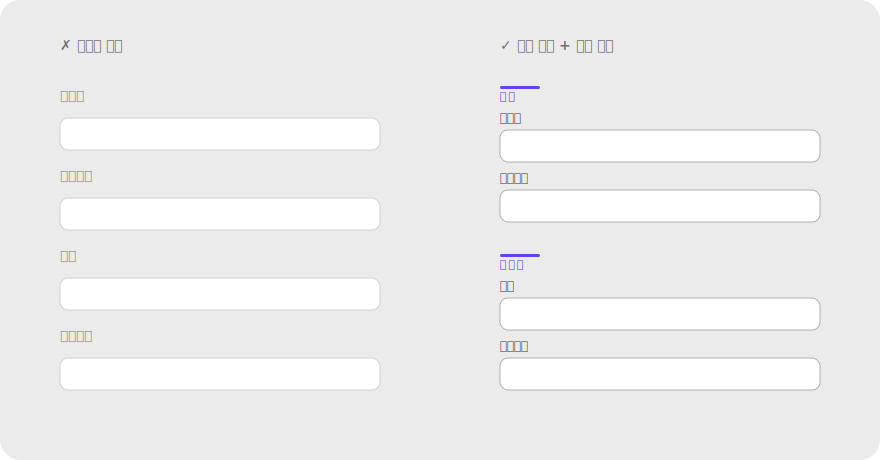

**레퍼런스**

- NN/g — Proximity Principle in Visual Design: https://www.nngroup.com/articles/gestalt-proximity/
- NN/g (영상) — Proximity: Gestalt Principle for UI Design: https://www.nngroup.com/videos/proximity-gestalt/
- IxDF — Gestalt Principles (Part 2): https://www.interaction-design.org/literature/article/laws-of-proximity-uniform-connectedness-and-continuation-gestalt-principles-2
- Palmer, S. & Rock, I. (1994). Rethinking perceptual organization: The role of uniform connectedness. *Psychonomic Bulletin & Review* — 그룹핑 단서 우선순위 실험.
- Han, S. & Humphreys, G. W. (1999). Interactions between perceptual organization based on Gestalt laws and those based on hierarchical processing. *Perception & Psychophysics*.

**체크리스트**

- [ ] 그룹 내부 간격이 그룹 사이 간격의 1/2 이하인가? (클러스터 임계비)
- [ ] 라벨이 자기 필드와 다음 필드 어느 쪽에 더 가까운가? 라벨-필드 비율 1:3 이상?
- [ ] 인라인 에러가 다음 필드 라벨보다 자기 필드에 명백히 가까운가?
- [ ] 헬프 텍스트와 다음 필드 라벨 간격 비율 1:4 이상?
- [ ] 카드 내부 패딩 < 카드 사이 간격?
- [ ] 그리드 카드의 가로 간격 = 세로 간격인가?
- [ ] 모바일에서 절대 간격(px·dp)을 유지하고 비례 축소하지 않았나?
- [ ] 터치 타겟 44pt/48dp 확보(시각 그룹은 좁아도 OK)?
- [ ] 다른 단서(색·모양·박스·선)와 충돌할 때 의도한 그룹이 우세한가?

---

### 2.2 유사성 Similarity

**정의** — 색·모양·크기·방향 등 시각 특성을 공유하는 요소들은 서로 관련된 것으로 지각된다. 달라 보이는 요소는 다른 그룹으로 본다.

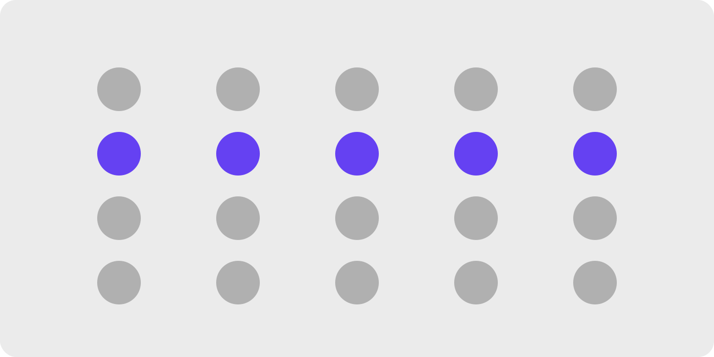
> 격자로 배열된 점들에서 한 줄(또는 한 열)만 색을 다르게 → 배치와 무관하게 색으로 묶여 보이는 예시.

**왜 (인지 원리)**

- 시각 특성(색·모양·크기·방향·텍스처) 중 **단 하나만 공유**해도 그룹이 형성된다. 단, 공유 특성의 차이가 **JND(just-noticeable difference)** 이상이어야 작동 — 두 색상의 ΔE가 1–2 이하면 시각 시스템이 동일하다고 처리.
- **특성별 그룹핑 강도(약 → 강)**: 방향 < 크기 < 모양 < 색 < 명도(luminance). 명도 차이가 가장 강력하므로 흑백 인쇄에서도 그룹이 유지되려면 명도 대비를 같이 설계해야 한다.
- **색 우선(color popout)** 효과: 색만 다른 항목은 100ms 이내에 "튀어나와" 보인다(Treisman, 1985). 그래서 **주요 CTA를 색으로 차별화하면 사용자가 사실상 즉시 발견**한다.
- 유사성이 깨지는 조건: ① 너무 많은 특성을 동시에 변주(색+모양+크기) → 각 특성의 그룹화 신호가 상쇄, ② 색맹/명도 비대응 → 색만으로 그룹화하면 8% 남성 사용자에서 신호 손실, ③ 다크모드/라이트모드 전환 시 동일 색의 의미가 달라짐.
- 접근성과 결합 — WCAG 1.4.1 "색만으로 정보 전달 금지" 조항은 유사성 원칙을 색으로만 적용하면 실패함을 명문화. 색 + 아이콘 + 라벨 등 **이중 부호화(redundant coding)** 권장.

**현장 적용 패턴**

*버튼 위계*

- Primary CTA 1개만 액센트 색(채움). Secondary는 outline, Tertiary는 ghost(텍스트만). 한 화면에 채움 버튼이 2개 이상이면 위계 소실.
- 같은 역할의 버튼은 같은 스타일 유지 — "확인" 버튼이 화면마다 모양/색이 다르면 학습 비용 ↑.
- 파괴적(destructive) 액션은 별도 색군(빨강 계열) 일관 적용. "삭제"가 일반 회색이면 위계가 약함.
- 아이콘 버튼 그룹: 모든 아이콘 스타일 통일(filled vs outlined 섞지 말 것). Material 가이드도 한 화면에서 한 스타일.

*상태·카테고리 색*

- 상태 의미 색은 시스템 전체에서 1:1 매핑 — 성공=초록, 경고=호박, 에러=빨강, 정보=파랑. 한 곳에서 어긋나면 학습 가치 손실.
- 카테고리 태그: 도메인별 색 1개로 고정. "결제" 관련 태그는 늘 같은 색. 동의어 색을 다양화하면 카테고리 인지 실패.
- 바뀐 상태 표시(dot/badge): 같은 종류의 알림은 같은 색·크기·위치.

*타이포그래피*

- 같은 역할의 텍스트는 정확히 같은 스타일(폰트·크기·웨이트·색) — H2는 어디서나 같은 H2.
- 본문에서 강조하려고 임의의 폰트/색을 쓰면 위계 붕괴. 강조는 **bold/italic/underline** 중 1가지만 통일.
- 링크 스타일: 색 + 밑줄(또는 hover 시 밑줄) — 일반 텍스트와 구분되는 단 하나의 시각 차이를 정해 모든 링크에 적용.

*아이콘·일러스트*

- 아이콘 시스템: line 또는 filled 한 스타일 선택해 전체 통일. 두께(stroke weight) 1.5px/2px도 통일.
- 빈 상태(empty state) 일러스트: 같은 스타일·팔레트 — 한 곳만 사진이고 다른 곳이 일러스트면 부분만 떠보임.
- 아바타 모양: 원 또는 사각형 중 한 시스템 — 섞으면 사용자 그룹/조직 그룹 같은 카테고리 차이로 오해.

*카드·리스트 패턴*

- 같은 종류의 카드는 같은 구조(이미지 위치·메타 위치·CTA 위치)·같은 비율. 뉴스 카드는 뉴스 카드끼리, 상품 카드는 상품 카드끼리.
- 카드 그림자/elevation: 같은 위계의 요소는 같은 elevation. 5dp/8dp가 섞이면 깊이 위계가 깨짐.
- 카드 hover/active 트랜지션도 통일 — 한 카드만 다른 애니메이션이면 의도된 차이로 오해.

*폼 입력 요소*

- 같은 필드 타입은 같은 모양·크기·패딩. text input과 select가 1px라도 다르면 시선 산만.
- 필수/선택 표시: 모든 필수 필드에 동일 표시(* 또는 "필수" 배지) — 일관되지 않으면 사용자는 "이 별표가 무슨 의미?" 추측.
- 비활성(disabled) 상태: 모든 disabled 요소가 같은 명도/opacity. 한 곳만 진하면 다른 의미로 오해.

*데이터·차트*

- 동일 시리즈는 모든 차트에서 같은 색 — "매출"이 막대차트에서 파랑이면 라인차트에서도 파랑.
- 음수/감소: 일관된 색(예: 빨강) + 일관된 부호(− 또는 ▼). 한쪽만으로 표현하지 말 것.
- 범주 순서: 그래프와 표·범례의 순서를 동일하게 유지 — 순서가 다르면 같은 데이터가 다르게 느껴짐.

*모션·인터랙션*

- 같은 트랜지션 시간·이징: 모든 모달 fade는 200ms ease-out. 한 곳만 300ms면 "더 무거운 화면"으로 오해.
- 같은 인터랙션 패턴: 호버 시 카드가 살짝 떠오르는 효과를 쓴다면 모든 클릭 가능 카드에 일관 적용.

**다른 법칙과의 상호작용**

- **근접성과 결합**: 같은 색 + 가까이 → 매우 강한 그룹. 다른 색 + 가까이는 보통 근접성 우세.
- **근접성에 짐**: 색이 같아도 멀리 떨어지면 같은 그룹으로 즉시 인지되지 않음(거리 부담 큼).
- **공통 영역에 짐**: 같은 카드 안에 있으면 색이 달라도 한 묶음으로 봄.
- **위계와 결합**: 유사성 + 한 곳만 깨기 = 가장 효율적인 강조 기법(예: 회색 버튼 4개 + 액센트 색 1개).

> **예시 데모** — [SVG 미리보기](./assets/examples/02-2-similarity-buttons.svg) · [HTML 데모](./assets/examples/02-2-similarity-buttons.html)
>
> 

**레퍼런스**

- NN/g — Similarity Principle in Visual Design: https://www.nngroup.com/articles/gestalt-similarity/
- NN/g (영상) — Similarity: https://www.nngroup.com/videos/similarity-gestalt-principle/
- Treisman, A. (1985). Preattentive processing in vision. *Computer Vision, Graphics, and Image Processing* — 색 popout 100ms.
- WCAG 2.2 — Use of Color (1.4.1): https://www.w3.org/WAI/WCAG22/Understanding/use-of-color

**체크리스트**

- [ ] 같은 역할의 요소가 모든 화면에서 동일한 시각 스타일인가?
- [ ] 주요 CTA는 색·형태로 보조 버튼과 명확히 구분되는가? 한 화면에 채움 버튼이 1개인가?
- [ ] 상태/카테고리 색이 시스템 전체에서 1:1 매핑인가?
- [ ] 색만으로 의미를 전달하지 않고 아이콘·텍스트로 이중 부호화했는가? (색맹 8% 대응)
- [ ] 아이콘 시스템이 한 가지 스타일(filled vs outlined)로 통일됐는가?
- [ ] 동일 데이터 시리즈가 모든 차트에서 같은 색·순서인가?
- [ ] 같은 종류 카드가 같은 구조·비율·elevation인가?
- [ ] "비슷하게 생겼는데 다른 일을 하는" 요소가 사용자를 헷갈리게 하지 않는가?

---

### 2.3 공통 영역 Common Region

**정의** — 하나의 경계(테두리·배경색·박스) 안에 있는 요소들은 한 그룹으로 지각된다. 20세기 후반에 추가된 법칙으로 UX 활용도가 매우 높다.

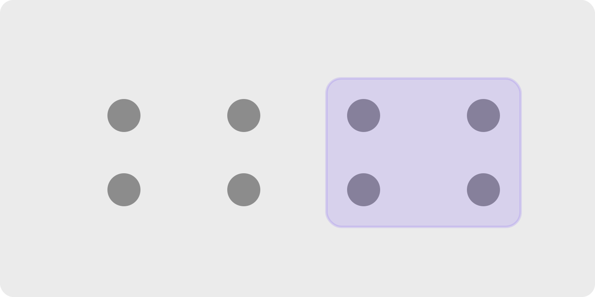
> 흩어진 점들 위에 박스(배경색 영역)를 씌우면, 박스 안 점들이 한 묶음으로 보인다. 근접성을 거스르고도 묶임이 만들어진다.

**왜 (인지 원리)**

- Palmer (1992)가 추가한 비교적 새로운 법칙. **이전 6개 법칙보다 우선순위가 높다** — 명시적 경계는 근접성·유사성을 모두 압도한다.
- 경계 신호 강도 위계(약→강): ① 배경색 tint → ② 가는 테두리(1px) → ③ 굵은 테두리 → ④ 그림자(elevation) → ⑤ 둘 이상 조합. **가장 약한 신호로 충분하면 거기서 멈춰야** 시각 복잡도 절약.
- 경계가 **너무 강하면** 안쪽 콘텐츠를 가둬버려 외부와 단절감이 과해진다(섬 효과). 카드 사이에 자연스러운 시선 흐름을 만들려면 경계는 최소화.
- **공통 영역의 함정** — 한 번 박스를 치면 시각적으로 "닫힌 단위"로 인지되므로, 그 단위가 의미적으로 결합도가 약하면 사용자는 "왜 묶였지?" 의문 → 인지 부하 증가.
- 모바일에서는 **카드 = 터치 가능 단위**라는 학습이 형성됨. 카드처럼 보이지만 클릭 안 되면 affordance 위반.

**현장 적용 패턴**

*카드 시스템*

- 카드 elevation 위계(예: 0/1/3/8dp): 0=배경, 1=기본 카드, 3=상호작용 중 카드, 8=floating(메뉴·모달). 위계가 곧 인터랙션 단계.
- 카드 라운드(border-radius) 통일 — 4·8·12·16 중 시스템 1개. 카드마다 다르면 위계 신호가 됨.
- 카드 안 카드(nested card)는 안티패턴 — 한 카드 안에서 sub-그룹이 필요하면 배경색 tint나 dividing line으로만 표현.
- 클릭 가능 카드: hover에서 elevation 또는 border 색 변화. 정적 카드와 시각적으로 구분되어야 함.

*패널·시트·드로어*

- 모달 다이얼로그: 전체 화면 ground 위 figure로 띄움. 카드 elevation 16dp + scrim 50% 어둡게.
- 바텀 시트: 핸들(grabber) + 모서리 라운드(12–16px 위쪽) — 끌어올림 affordance.
- 사이드 패널(drawer): 메인 콘텐츠와 1px divider 또는 그림자로 영역 구분.
- 인라인 노트/콜아웃: 좌측 색 테두리(4px) + 옅은 배경 — 본문 안의 "다른 종류" 단위 표시(예: 경고·팁).

*폼·설정 화면*

- 관련 설정 묶기: 알림 / 개인정보 / 보안 등 카테고리별 카드. 각 카드 안에 토글·필드 묶음.
- fieldset 박스: 폼 섹션이 시각적으로 명확해야 할 때(예: 결제 정보 vs 배송 정보). 단, 옅은 배경 tint로 시작하고 테두리는 마지막 수단.
- 입력 필드 자체도 공통 영역 — placeholder, prefix, suffix, 단위 표시가 한 박스 안에 있어 한 입력 단위로 인지.

*내비게이션*

- 활성 탭/메뉴 항목: 배경색 tint로 표시(테두리·언더라인보다 가볍게). 호버는 더 옅은 tint.
- 사이드바 그룹 헤더: 옅은 구분선 또는 헤더 영역만 다른 배경으로 표시.
- breadcrumb 마지막 항목(현재 위치): 굵게 + 옅은 tint chip.

*데이터 시각화*

- 대시보드 위젯: 각 위젯이 카드로 묶여 데이터 단위 인지.
- 차트 안 highlight 구간: 옅은 색 영역(예: 주말 표시)으로 "이 구간은 다른 의미" 신호.
- 표(table) 그룹 행: 헤더 행에 옅은 배경 tint로 sub-그룹 표시.

*알림·상태*

- Toast/Snackbar: 화면 가장자리에 카드 형태로 띄워 메인 콘텐츠와 분리.
- Banner: 페이지 상단 가로 전폭 영역 + 색 배경 — 시스템 수준 공지.
- Inline alert: 본문 안 박스로 표시되 본문과 구분.

*가격표·추천 강조*

- 추천 플랜만 다른 색 테두리(2–3px) + 작은 "추천" 뱃지 — 한 컬럼만 figure로 떠오름.
- 비교 표에서 추천 컬럼 배경에 옅은 tint.

**다른 법칙과의 상호작용**

- **근접성·유사성을 압도(이김)**: 멀거나 다른 색 요소도 같은 박스 안에 있으면 한 묶음으로 봄.
- **연결성과 동급**: 둘 다 명시적 경계 신호. 연결선이 박스 밖으로 나가면 박스의 닫힘이 깨짐.
- **전경-배경과 결합**: 카드 + 그림자 = 강한 figure. 평면 카드는 그림자 없이도 figure지만 약함.
- **남용 시 위계 소실**: 모든 그룹에 박스 → "상자 천지" 안티패턴(§5.3). 여백 → tint → 테두리 → 그림자 순으로 한 단계씩 강화.

> **예시 데모** — [SVG 미리보기](./assets/examples/02-3-common-region-cards.svg) · [HTML 데모](./assets/examples/02-3-common-region-cards.html)
>
> 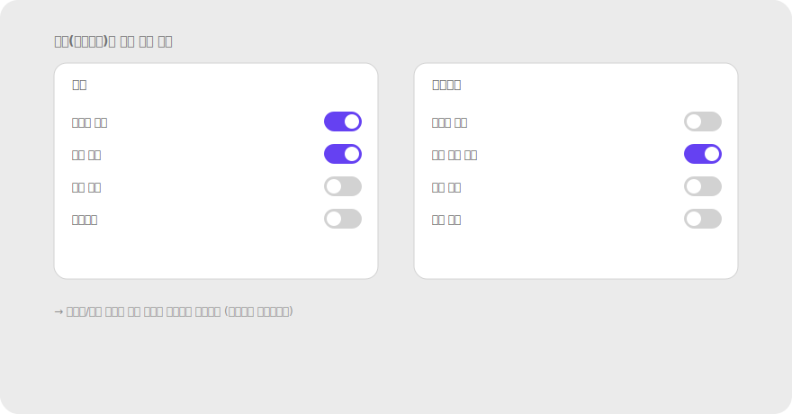

**레퍼런스**

- NN/g — The Principle of Common Region: Containers Create Groupings: https://www.nngroup.com/articles/common-region/
- Palmer, S. (1992). Common region: A new principle of perceptual grouping. *Cognitive Psychology* — 원전.
- Material Design — Cards: https://m3.material.io/components/cards/overview
- Apple HIG — Boxes & Group views: https://developer.apple.com/design/human-interface-guidelines/boxes

**체크리스트**

- [ ] 경계를 추가하기 전에 여백만으로 묶을 수 없는지 검토했는가?
- [ ] tint → 테두리 → 그림자 순으로 가장 약한 신호부터 시도했는가?
- [ ] 카드 안 카드(nested)나 모든 섹션 박스화 같은 남용은 없는가?
- [ ] 카드처럼 보이는데 클릭 안 되는 요소가 있어 affordance 거짓말을 하고 있지 않은가?
- [ ] elevation 위계(0/1/3/8dp)가 인터랙션 단계와 일치하는가?
- [ ] 카드 라운드·여백·shadow가 시스템 토큰으로 통일됐는가?

---

### 2.4 연결성 Uniform Connectedness

**정의** — 선·막대 등으로 물리적으로 연결된 요소들은 한 그룹으로 지각된다. 근접성·유사성의 차이를 덮을 만큼 강하다.

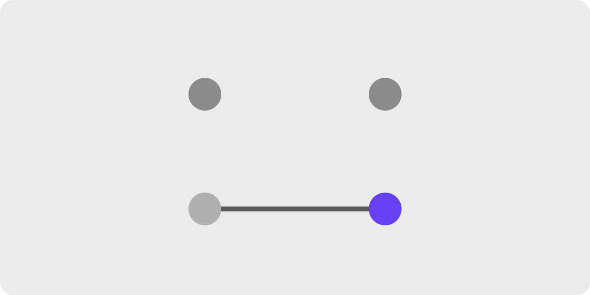
> 떨어진 두 요소를 선으로 연결한 버전 vs 안 한 버전. 색/거리가 달라도 연결선이 묶음을 만든다.

**왜 (인지 원리)**

- Palmer & Rock (1994)이 정립. **모든 그룹핑 단서 중 가장 강력**한 신호 — 근접성·유사성·심지어 공통 영역과 충돌해도 보통 이긴다.
- 시각 시스템은 물리적으로 이어진 영역을 "같은 객체"의 일부로 강하게 추정한다. 진화적으로 자연계의 윤곽선이 연속적이라는 통계 규칙성에서 비롯된 것으로 본다.
- 연결성의 종류: ① **명시적 선**(stepper의 화살표) ② **공유 경계**(인접한 셀) ③ **연속된 영역**(segmented control의 한 막대) — 모두 같은 효과지만 시각 무게는 다름.
- 임계 조건 — 연결선이 너무 가늘면(1px 이하) 그룹 신호가 약함. 너무 굵으면(>4px) 선 자체가 figure가 되어 콘텐츠와 경쟁.
- **잘못 연결된 신호의 위험성** — 의도치 않은 가로선(예: 카드 사이의 divider)이 두 카드를 묶을 수 있음. 사용자는 "이 둘이 관련 있다"고 잘못 해석.

**현장 적용 패턴**

*단계·진행 인디케이터*

- Multi-step 폼/체크아웃: 단계 원들을 선으로 이어 "하나의 흐름"임을 표시. 완료된 단계는 채움 색으로 진행 정도 표시.
- 수직 stepper(좌측 사이드): 단계 사이 세로선. 모바일에 적합.
- progress bar: 단계가 아니라 연속 비율일 때.
- 체크리스트 진행: 각 항목 앞 원 + 연결선 → 하나의 task 묶음.

*컨트롤 그룹*

- Segmented control: 옵션들이 한 막대(rounded rectangle)에 붙어 "상호 배타적 선택"임을 시각화.
- Toggle button group(굵게/기울임/밑줄): 인접해 붙은 버튼 그룹 — 같은 종류의 토글이라는 신호.
- 페이지네이션: 페이지 번호들이 한 줄 컨테이너 안에서 인접 → 같은 페이지 집합.
- Tabs: 탭들이 한 가로선 위에 인접 + active 탭 밑줄로 현재 위치 강조.

*내비게이션·계층 구조*

- 브레드크럼: ">" 또는 "/" 구분자로 시각적 연결 — 계층 경로 표시.
- 트리 뷰(file explorer): 들여쓰기 + 점선/실선으로 부모-자식 연결.
- 네비게이션 화살표: "이전"·"다음" 버튼이 다음 단계를 가리키며 이어짐을 암시.

*관계 시각화*

- 노드-엣지 다이어그램: 플로우차트, 마인드맵, 조직도.
- Gantt 차트: task 간 의존 화살표.
- 연결선이 시점-종점이 분명해야 함 — 화살표 머리, 색, 굵기로 방향성·강도 표현.

*데이터 시각화*

- Line chart: 점들을 잇는 선이 시계열 흐름을 표현. 점만 있으면 무관해 보임.
- Sankey diagram: 흐름의 양을 폭으로 표현하며 출발지-목적지 연결.
- Network graph: 노드 간 관계의 강도를 선 굵기·색으로 표현.

*대화·스레드*

- 댓글 스레드의 좌측 들여쓰기 + 세로선: 부모-자식 관계 표시.
- 메신저 말풍선 그룹: 같은 발신자의 연속 메시지를 시각적으로 묶음(꼬리 모양·색).

*데이터 입력*

- Range slider 양쪽 핸들 + 사이 채워진 막대: 두 핸들이 한 선택 범위.
- 연결된 입력(예: from–to 날짜): 두 필드 사이를 시각적으로 잇는 아이콘(→) 또는 한 행에 배치.

**다른 법칙과의 상호작용**

- **모든 단서를 압도**: 색·모양·거리 차이를 다 덮음. 가장 강력한 그룹 신호.
- **공통 영역과 경쟁**: 박스 안과 박스 밖을 잇는 연결선은 박스의 닫힘을 부분적으로 깨뜨림.
- **의도치 않은 연결**: divider, 표 안 가로선이 무관한 행을 묶는 사고가 흔함. 시각적 선이 의미적 그룹과 일치하는지 확인 필수.
- **연속성과 결합**: 연결선의 곡률·방향이 매끄러우면(연속성) 그룹화 신호가 더 안정적.

> **예시 데모** — [SVG 미리보기](./assets/examples/02-4-connectedness-stepper.svg) · [HTML 데모](./assets/examples/02-4-connectedness-stepper.html)
>
> 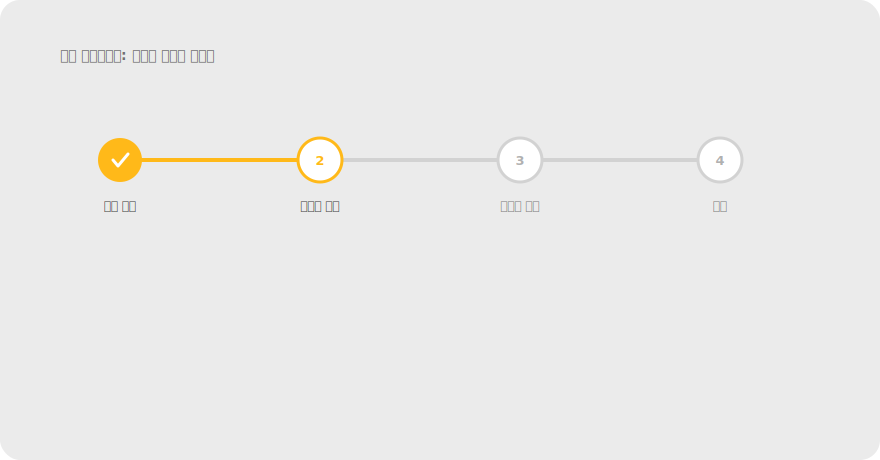

**레퍼런스**

- NN/g (영상) — Connectedness: https://www.nngroup.com/videos/connectedness-gestalt/
- Palmer, S. & Rock, I. (1994). Rethinking perceptual organization: The role of uniform connectedness. *Psychonomic Bulletin & Review*.
- IxDF — Part 2 (Uniform Connectedness 포함): https://www.interaction-design.org/literature/article/laws-of-proximity-uniform-connectedness-and-continuation-gestalt-principles-2

**체크리스트**

- [ ] 흐름·순서·관계를 표현하는 곳에 연결선·인접 컨테이너를 활용했는가?
- [ ] 의도치 않은 가로선/세로선이 무관한 요소를 묶고 있지 않은가?
- [ ] 연결선의 굵기·색이 콘텐츠와 경쟁할 만큼 강하지 않은가? (1.5–2px가 보통 안전)
- [ ] segmented control vs 분리된 버튼 — 의미적으로 상호배타적이면 segmented가 맞는 선택인가?
- [ ] 단계 인디케이터에서 완료/진행중/대기 상태가 색·모양으로 구분되는가?

---

### 2.5 연속성 Continuity / Good Continuation

**정의** — 눈은 선과 곡선을 따라 자연스럽게 이어서 지각한다. 정렬되어 한 방향으로 흐르는 요소들을 한 그룹·한 경로로 본다.

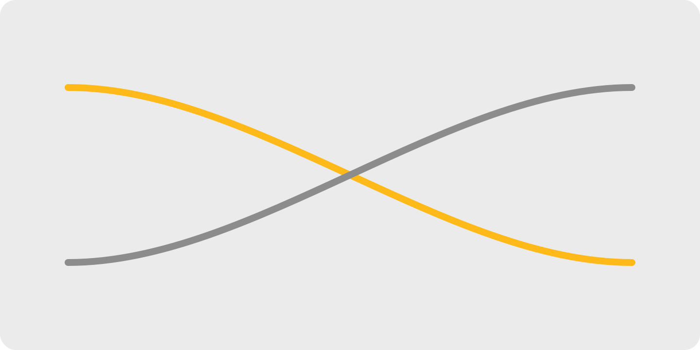
> 일렬로 정렬된 요소들이 하나의 경로로 읽히는 예시, 또는 두 선이 교차할 때 꺾이기보다 매끄럽게 이어 보이는 예시.

**왜 (인지 원리)**

- 시각 시스템은 급격한 방향 전환보다 **매끄러운 연속**을 선호한다(Wertheimer, 1923). 두 선이 교차할 때 90도 꺾어서 보지 않고 두 개의 부드러운 곡선으로 본다.
- **시선 경로 형성** — 정렬된 요소들은 자동으로 시선의 "트랙"을 만든다. 좌측 정렬된 텍스트의 왼쪽 가장자리, 그리드의 격자선, 수직 정렬된 CTA 모두 동일 원리.
- **읽기 패턴(F·Z·layer-cake)**은 연속성의 응용 — F-패턴은 시선이 텍스트 라인을 따라 수평으로 흐르다 좌측 정렬축을 따라 수직 하강. Z-패턴은 시각 요소가 많을 때 헤더→히어로→CTA로 대각선 흐름.
- **잘 정렬된 그리드**가 신뢰감을 주는 이유는 시선 경로가 매끄러워 인지 부하가 낮기 때문. 금융·정부 서비스에서 그리드 일관성이 특히 중요한 이유.
- 연속성이 깨질 때: ① 정렬축이 약간씩 어긋남(2–4px) — 명시적 잘못보다 더 불쾌, 잠재의식적 불안 ② 곡선이 부드럽지 않은 베지에 곡선 ③ 텍스트 줄바꿈이 불규칙(rag).

**현장 적용 패턴**

*정렬·그리드 시스템*

- 8pt 또는 4pt 스페이싱 시스템: 모든 여백·요소 크기를 8(또는 4)의 배수로 → 자동으로 정렬되어 시선 흐름 매끄러움.
- 컬럼 그리드(12/16-col): 모든 콘텐츠가 같은 컬럼 폭에 정렬 → 페이지를 스크롤할 때 시선 축이 흔들리지 않음.
- 좌측 정렬 라벨 + 좌측 정렬 인풋 → 폼 전체가 한 수직선으로 읽힘.
- 리스트 아이콘들이 같은 수직선에 정렬 → 텍스트도 같은 수직선 → 두 트랙이 평행해 시선이 부드럽게 내려감.

*스캔 패턴 활용*

- 텍스트 중심 페이지: F-패턴 — 상단 헤드라인 + 좌측에 핵심 정보 배치(처음 두 단어가 가장 많이 읽힘).
- 시각 중심 페이지: Z-패턴 — 로고(좌상) → 메뉴(우상) → 히어로 이미지/CTA(좌하/우하) 대각선 흐름.
- 레이어케이크 패턴(가로 폭이 큰 페이지): 가로 띠가 위에서 아래로 쌓이는 구조 — 각 띠는 단일 메시지.

*스크롤·페이지 흐름*

- Carousel/슬라이더: 다음 카드를 24–40px peek로 자르기 → "옆으로 더 있음" 경로 암시.
- 무한 스크롤: 페이지 끝에 옅은 로딩 스피너 → 콘텐츠 흐름이 "끊기지 않음" 신호.
- 스크롤 시 sticky 헤더가 자연스럽게 따라옴 → 시선 기준점이 유지됨.

*내비게이션·읽기 동선*

- 리스트의 행 사이 미세한 hover line(1px) → 마우스 위치를 잃지 않게 가이드.
- 읽기 진행률 바(article progress bar): 페이지 상단 고정 — 현재 위치를 연속적으로 표시.
- 사이드바 active item에서 메인 콘텐츠로 연결되는 시각 흐름(예: 활성 메뉴 색 = 메인 헤더 색).

*차트·데이터 시각화*

- Line chart의 부드러운 곡선(monotone interpolation) — 시계열의 흐름을 직관적으로 전달.
- 축 눈금이 일정한 간격(linear scale 또는 log scale 명시) → 곡선의 의미가 일관.
- 범례 색-라인 위치 정렬: 차트 위 라인 끝 = 범례 색의 위치 매핑.

*마이크로 정렬*

- 아이콘과 텍스트의 baseline 정렬 — 아이콘이 텍스트의 가운데에 시각적으로 맞아야(geometric center ≠ optical center 주의).
- 버튼 안 텍스트는 정확히 가운데 — 위/아래 패딩 비대칭이면 글자가 "기울어진" 느낌.
- 단위(₩·%)와 숫자 사이 0px 또는 일관 간격.

*애니메이션 경로*

- 요소 이동 경로가 일직선 또는 부드러운 곡선 — 갑작스러운 방향 전환은 시선이 따라가지 못함.
- Magic move / shared element transition: 같은 요소가 화면 간에 연속해서 이동(iOS Photos 앱).
- easing 곡선: ease-in-out가 자연스럽고, linear는 기계적이라 거리감.

**다른 법칙과의 상호작용**

- **근접성·유사성과 결합**: 잘 정렬된 + 비슷한 요소는 강한 연속 경로 형성.
- **공동운명과 결합**: 연속된 경로를 따라 같이 움직이면 흐름 신호 ↑↑.
- **잘못 정렬되면 모든 신호 약화** — 2–4px 어긋남은 명시적 오류보다 더 거슬리는 잠재의식 부담.

> **예시 데모** — [SVG 미리보기](./assets/examples/02-5-continuity-carousel.svg) · [HTML 데모](./assets/examples/02-5-continuity-carousel.html)
>
> 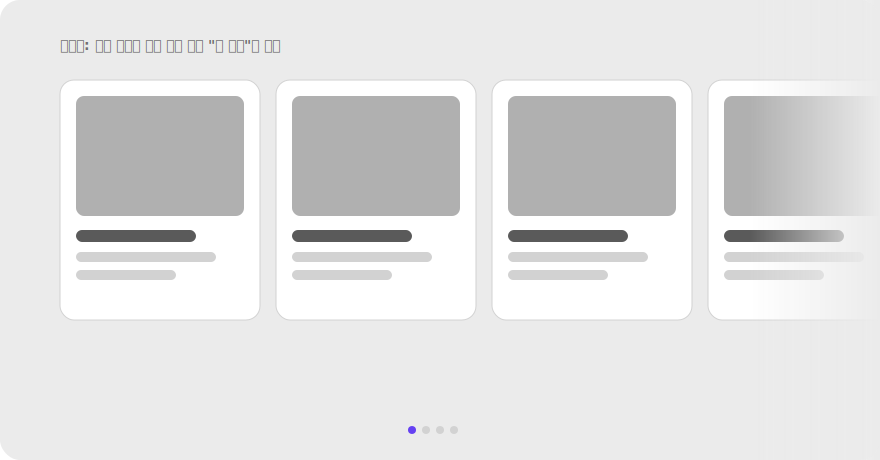

**레퍼런스**

- NN/g (영상) — Continuation: https://www.nngroup.com/videos/continuation-gestalt/
- NN/g — F-Shaped Pattern of Reading on the Web: https://www.nngroup.com/articles/f-shaped-pattern-reading-web-content/
- IxDF — Part 2: https://www.interaction-design.org/literature/article/laws-of-proximity-uniform-connectedness-and-continuation-gestalt-principles-2
- Material Design — Layout grid: https://m3.material.io/foundations/layout/applying-layout/window-size-classes

**체크리스트**

- [ ] 모든 요소가 명확한 그리드 축(4/8pt)에 정렬되어 있는가?
- [ ] 폼 라벨·인풋·CTA가 같은 수직선을 따라 흐르는가?
- [ ] 캐러셀/스크롤에서 "더 있음"을 시각적으로 암시하는가? (peek, fade)
- [ ] 스캔 패턴(F/Z)을 고려해 핵심 정보를 첫 시선 지점에 두었는가?
- [ ] 아이콘과 텍스트의 baseline·optical center가 정렬됐는가?
- [ ] 애니메이션 경로가 부드러운 곡선·일직선이고 갑작스러운 꺾임이 없는가?

---

### 2.6 폐쇄성 Closure

**정의** — 외부 자극이 어떤 형태와 부분적으로 맞아떨어지면, 사람은 빈 곳을 스스로 채워 완성된 형태로 지각한다.

> 끊긴 원/사각형이 완성된 도형으로 보이는 예시, 또는 세 개의 팩맨 모양이 (실재하지 않는) 삼각형을 만드는 카니자 삼각형.

**왜 (인지 원리)**

- Kanizsa (1955)의 환영 삼각형 실험이 대표 예시 — 세 개의 부분만으로도 뇌가 가운데 흰 삼각형을 "본다". 이 인식은 V2 영역에서 100ms 이내에 자동 발생.
- **시각 정보가 부족해도 뇌는 환경을 이해하려 빈틈을 메운다**. 다만 **올바른 경계를 만들 충분한 단서가 있을 때만** 작동한다(Wagemans, 2012). 단서가 너무 적으면 인식 실패.
- **선험 지식의 영향** — 사용자가 익숙한 형태(원·삼각형·로고)일수록 더 적은 단서로 폐쇄됨. 처음 보는 형태는 단서가 많아야 닫힘.
- 폐쇄성은 **자동·전주의(preattentive)** 단계에서 작동 — 사용자가 의식적으로 "이건 무슨 모양?" 추론하지 않아도 즉시 완성된 형태로 인식.
- 한계 — ① 단서가 너무 적으면 닫히지 않음 ② 동시에 여러 닫힘 후보가 있으면 모호성 발생 ③ 회전·왜곡된 부분 단서는 폐쇄 실패율 ↑.

**현장 적용 패턴**

*로고·아이콘 디자인*

- FedEx 로고의 숨겨진 화살표 — E와 x 사이 음각.
- WWF 판다 — 부분만으로 판다 전체 인식.
- IBM 로고 — 8개 가로선만으로 글자 형태 완성.
- 미니멀 아이콘: 최소한의 선으로 형태 암시(stroke 아이콘이 filled보다 더 폐쇄성 활용).
- 주의: 너무 추상화하면 인식 실패. A/B 테스트로 "이게 무엇인지 5초 안에 말할 수 있나" 검증.

*"더 있음" 암시*

- 리스트 아래쪽 fade gradient(투명도 → 배경색) → 스크롤하면 더 있음.
- 캐러셀 가장자리에서 다음 카드 일부 잘라 보임 → 가로 스크롤 암시(폐쇄성 + 연속성).
- 드롭다운 아래쪽 절단 + opacity → 펼치면 더 많은 옵션.
- "3개 더 보기" 같은 명시적 텍스트보다 시각 폐쇄성 단서가 더 자연스러움(클릭 없이 인지).

*Skeleton screen·로딩*

- Skeleton 콘텐츠는 폐쇄성으로 "곧 채워질 형태"를 미리 보여줘 대기 시간 체감 단축.
- 제목 자리 → 회색 가로 막대, 이미지 자리 → 회색 사각형, 본문 → 여러 줄 회색 막대 — 사용자는 "여기에 콘텐츠가 올 것"을 자동 추론.
- Skeleton vs spinner: skeleton이 폐쇄성으로 "구조"를 알리므로 더 빠른 인지.

*아바타·이니셜 fallback*

- 프로필 이미지 없을 때 원 안 이니셜 — 원은 닫힌 형태로 "사람의 정체"를 채움.
- 단순 도형 아바타도 동일.

*Progress·상태 표시*

- Circular progress ring: 호의 일부만 보여도 "원이 완성될 예정"을 인지(폐쇄성으로 진행률 직관화).
- 단계별 체크박스: 완료 체크마크가 원 안에 닫혀 "완료된 단위"로 인식.
- Donut chart 안 가운데 숫자 — 빈 가운데가 "닫힌 영역"으로 인지되어 숫자가 강조됨.

*레이아웃·이미지*

- 히어로 이미지가 컨테이너 밖으로 살짝 잘림 — 사용자가 마음속에서 전체 이미지를 완성.
- 카드 이미지 상단을 둥글게 잘라 카드 모양과 결합 — 닫힌 단위로 인지.
- 히트맵·차트 가장자리 잘림 — 데이터가 더 있음 암시.

*UI 컴포넌트*

- Tab 컨테이너의 active 탭이 아래로 "이어진" 영역(밑변 없는 박스) → 콘텐츠가 탭에 속함을 폐쇄로 형성.
- Tooltip의 화살표 — 트리거에 "연결되어 있음"을 닫힌 도형으로 표현.
- 햄버거 메뉴 아이콘 — 세 가로선만으로 "메뉴 목록" 형태 인식.
- 햄버거 메뉴는 폐쇄성이 약해 학습이 필요(인지 부담) — "MENU" 라벨 병기 권장.

**다른 법칙과의 상호작용**

- **유사성·연속성과 결합**: 부분 단서가 같은 모양·매끄럽게 이어지면 폐쇄가 더 안정적.
- **전경-배경 의존**: 닫힐 형태가 figure로 인지되어야 작동. 배경이 너무 복잡하면 폐쇄 신호 약화.
- **과한 생략은 안티패턴(§5.5)** — 핵심 단서까지 빼면 인식 실패. 가독성 테스트 필수.

> **예시 데모** — [SVG 미리보기](./assets/examples/02-6-closure-readmore.svg) · [HTML 데모](./assets/examples/02-6-closure-readmore.html)
>
> 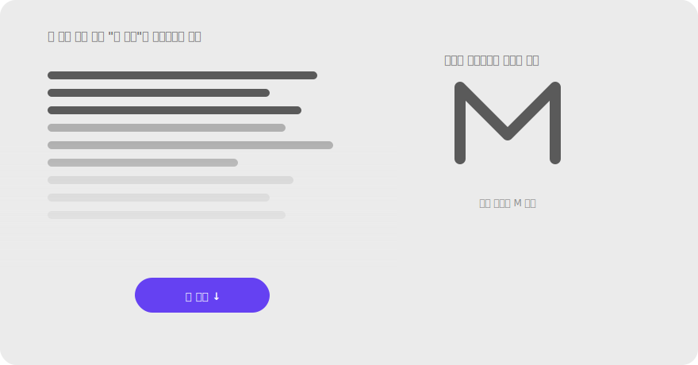

**레퍼런스**

- NN/g — Principle of Closure in Visual Design: https://www.nngroup.com/articles/principle-closure/
- IxDF — Law of Closure: https://www.interaction-design.org/literature/topics/law-of-closure
- Kanizsa, G. (1955). Margini quasi-percettivi in campi con stimolazione omogenea. *Rivista di Psicologia* — 환영 윤곽선 원전.

**체크리스트**

- [ ] 형태를 완성하기에 충분한 단서를 남겼는가? (과한 생략 금지)
- [ ] 잘린 콘텐츠가 "더 있음"을 자연스럽게 암시하는가?
- [ ] skeleton screen이 실제 콘텐츠 구조를 미리 보여주는가?
- [ ] 아이콘이 5초 인식 테스트를 통과하는가?
- [ ] 닫힐 형태가 figure로 명확히 떠오르는가? (배경이 방해하지 않음)

---

### 2.7 전경-배경 Figure/Ground

**정의** — 사람은 장면을 전경(figure, 주목 대상)과 배경(ground)으로 나누고, 전경에 지각을 집중한다.

> 루빈의 꽃병(얼굴/꽃병) 또는 모달 다이얼로그가 어두운 오버레이 위로 떠오르는 화면.

**왜 (인지 원리)**

- Rubin (1915)의 꽃병-얼굴 실험이 원전 — 시각 시스템은 장면을 자극 입력 후 약 **80–150ms 안에** 전경(figure)과 배경(ground)으로 가른다.
- **figure 결정 단서**(약→강): ① 작은 영역이 figure 경향 ② 둘러싸인 영역 ③ 대칭적·규칙적 모양 ④ 의미 있는 형태(얼굴·문자) ⑤ **명도·색 대비**(가장 강력) ⑥ **그림자/depth 단서**.
- **한 번에 하나의 해석에만 집중** — 루빈의 꽃병에서 사용자는 동시에 둘을 못 보고 번갈아 본다. UI에서도 "전경이 명확하지 않으면 사용자가 어디를 봐야 할지 갈팡질팡".
- WCAG **명도 대비 비율** 권장(전경:배경): 일반 텍스트 4.5:1, 큰 텍스트 3:1, UI 컴포넌트·아이콘 3:1. 이게 곧 전경-배경 분리 신호.
- **figure 과잉의 함정**: 한 화면에 강한 figure가 3개 이상이면 모두 평등해져 전경 신호 소실 → "전부 강조 = 강조 없음" 안티패턴.

**현장 적용 패턴**

*모달·오버레이*

- 모달: scrim(반투명 검정 50–60% opacity) + 카드 elevation 16–24dp + 그림자 → 카드가 강한 figure.
- Bottom sheet: 부분 scrim 또는 핸들로 "주 화면 위에 띄워짐" 신호.
- Popover/Tooltip: 작은 그림자 + 화살표로 트리거에 연결된 figure.
- Notification banner: 페이지 상단에 색 배경 띠 — 시스템 수준 figure.
- Toast: 화면 한쪽에 elevation 카드.

*CTA·강조*

- 주요 CTA: 채움 색(액센트) + 충분한 여백 + (선택) drop shadow → 다른 모든 UI보다 figure로 떠오름.
- 한 화면에 강한 figure는 1–2개로 절제 — 3개 이상이면 시선이 분산되고 "모두 강조 = 강조 없음".
- 배경에서 figure를 띄우는 방법: 색 대비 > 크기 > 위치(중앙) > 그림자.

*상태 표시*

- 활성/선택된 상태: 배경 tint + 강한 색 텍스트 + (옵션) 좌측 색 바 → 다른 항목들과 figure-ground 분리.
- 비활성(disabled): opacity 40–50% → 배경으로 물러남(ground화).
- Loading 상태: 컨테이너 자체를 옅게 + spinner 또는 skeleton 표시.
- Error 상태: 빨강 + 굵은 텍스트 — figure로 강하게 떠오르도록.

*가독성 (배경 이미지 위 텍스트)*

- 히어로 이미지 + 텍스트 — **그라디언트 scrim** 필수. 텍스트가 위치할 영역에 검정 0–70% 그라디언트.
- Frosted glass(backdrop-filter blur): 텍스트 뒤만 흐려서 figure 보강 (iOS·macOS 스타일).
- 텍스트 자체에 text-shadow — 미세하게 어두운 그림자로 가장자리 분리.
- 글자 외곽선(stroke) — 최후 수단, 가독성 떨어질 수 있음.

*계층 구조 (depth)*

- Elevation 시스템(0/1/3/8/16dp): 위계가 곧 figure-ground 단계. 0=배경, 16=모달.
- z-index 명시적 관리: 모든 floating UI(드롭다운·툴팁·모달)의 z-index를 토큰으로 관리.
- 활성 윈도우(여러 패널 중) 강조: 비활성 패널을 옅게(opacity 70–80%).

*Focus·Hover 상태*

- Focus ring: 키보드 접근성 — 2–3px 두께 + 액센트 색. WCAG 2.4.7 준수.
- Hover: 배경색 tint 또는 elevation 상승 → 상호작용 가능한 figure 강조.
- Active(pressed): 색 더 진하게 + (옵션) 미세한 scale 감소 → 누르는 감각.

*카드·콘텐츠 영역*

- 카드 elevation: shadow + 약간의 색 차이(흰 카드 + 옅은 회색 배경).
- Sidebar vs main: 메인 영역이 figure, 사이드바는 ground(더 옅은 배경 또는 다른 색).
- Sticky header: 스크롤 시 그림자 추가 → 콘텐츠 위에 떠 있음을 강조.

**다른 법칙과의 상호작용**

- **모든 그룹핑 단서와 결합**: figure 안의 요소들은 더 강하게 묶임.
- **대비가 핵심 단서**: 색·명도·크기·shadow 대비가 강할수록 figure-ground 분리 강력.
- **과잉은 안티패턴(§5.4)** — 모든 것이 figure면 전경 신호 소실.
- **접근성 의무**: WCAG 명도 대비 비율 충족이 곧 figure-ground 분리의 정량 기준.

> **예시 데모** — [SVG 미리보기](./assets/examples/02-7-figure-ground-modal.svg) · [HTML 데모](./assets/examples/02-7-figure-ground-modal.html)
>
> 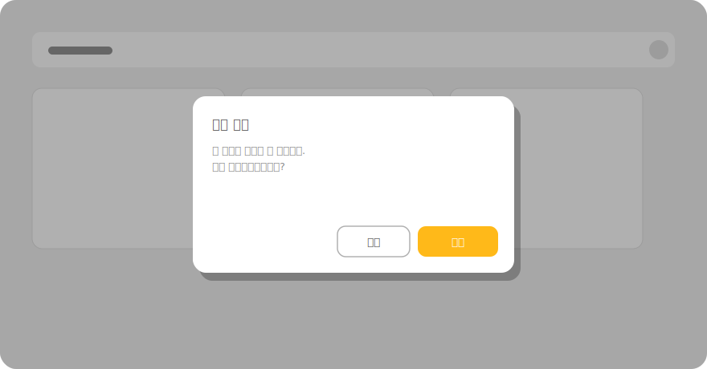

**레퍼런스**

- NN/g (영상) — Figure/Ground: https://www.nngroup.com/videos/figure-ground-gestalt/
- Rubin, E. (1915). Visuell wahrgenommene Figuren — 원전.
- WCAG 2.2 — Contrast (Minimum) 1.4.3: https://www.w3.org/WAI/WCAG22/Understanding/contrast-minimum
- Material Design — Elevation: https://m3.material.io/styles/elevation/overview
- Apple HIG — Materials & Vibrancy: https://developer.apple.com/design/human-interface-guidelines/materials

**체크리스트**

- [ ] 사용자가 "지금 봐야 할 것(전경)"이 분명한가?
- [ ] 한 화면에 강한 figure가 1–2개로 절제됐는가?
- [ ] 배경 이미지 위 텍스트 대비가 WCAG 4.5:1 이상인가?
- [ ] 활성/비활성/hover/focus 상태가 명확히 figure-ground로 구분되는가?
- [ ] 모달·시트의 scrim + elevation이 충분히 강한가?
- [ ] Focus ring이 키보드 사용자에게 명확히 보이는가?

---

### 2.8 공동운명 Common Fate

**정의** — 같은 방향·같은 속도로 함께 움직이는 요소들은 한 그룹으로 지각된다. 가만히 있거나 다르게 움직이는 요소와는 구별된다.

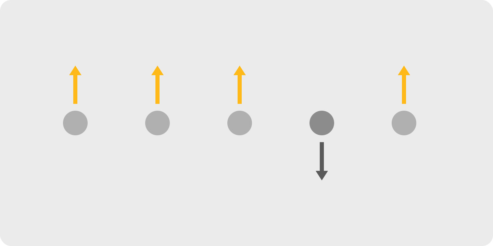
> 정적 매체로는 표현이 어려우니, 함께 펼쳐지는 서브메뉴/아코디언의 전·후 프레임 또는 움직임 방향 화살표로 표현.

**왜 (인지 원리)**

- 같은 방향·같은 속도로 움직이는 요소들은 강하게 묶인다. **시간 차원이 결합된 그룹핑 단서**라 시각 디자인에서 자주 잊히지만, 인터랙티브 UI에서는 가장 강력한 신호 중 하나.
- 자연계에서 함께 움직이는 것은 대개 같은 객체(예: 한 무리 새, 자동차 부품) → 시각 시스템이 이 통계 규칙을 학습.
- **모션 동기화 정확도** — 4–8 프레임(67–133ms) 이내 동기화면 같은 그룹으로 인식. 그 이상 어긋나면 별개로 분리.
- **공동운명의 응용 범위** — 펼침/접힘 애니메이션, 드래그 다중 선택, 페이지 전환, 모달 등장, 스크롤 시 sticky 요소가 함께 따라옴, 캐러셀 슬라이드.
- 한계 — 동시 움직임이 과하면 어지러움(motion sickness) 유발. `prefers-reduced-motion` 설정 사용자에 대해 모션 최소화 필수(WCAG 2.3.3).

**현장 적용 패턴**

*펼침·접힘*

- Accordion: 펼침 시 펼쳐진 콘텐츠와 그 아래 항목들이 같은 방향(아래)으로 함께 이동 → "한 시스템"임을 인지.
- Tree view 노드: 부모를 펼치면 자식들이 함께 등장, 접으면 함께 사라짐.
- 드롭다운 메뉴: 옵션들이 함께 펼쳐짐 — 한 메뉴 단위로 인식.
- 확장 가능 카드: 카드 자체가 확장되고 안의 추가 콘텐츠가 함께 등장.

*페이지·뷰 전환*

- iOS push transition: 새 화면이 오른쪽에서 슬라이드인 + 이전 화면이 왼쪽으로 슬라이드아웃 — "다음/이전"의 공간 메타포.
- Modal sheet: 아래에서 위로 슬라이드업 — bottom sheet의 위치 메타포.
- Hero(shared element) transition: 같은 요소가 화면 간에 연속 이동(iOS Photos에서 썸네일이 풀스크린으로).
- Tab 전환: 콘텐츠가 좌우로 슬라이드 — 같은 탭 시스템 안의 형제.

*드래그·다중 선택*

- 여러 항목 선택 후 드래그 시 모두 함께 이동 → "한 그룹"임을 시각화.
- 드래그 중인 요소가 다른 그룹 위로 호버하면 그 그룹이 함께 살짝 흔들리거나 색 변함 → drop target 신호.
- Sortable list: 한 아이템을 드래그하면 주변 아이템들이 자리를 비켜주는 모션.

*스크롤·sticky·parallax*

- Sticky header: 스크롤 시 콘텐츠는 위로, 헤더는 고정 → 헤더가 "다른 운명"으로 분리됨을 알림.
- Sticky table header/column: 표 스크롤 시 헤더만 고정.
- Parallax: 배경과 전경이 다른 속도 — 깊이감 표현이지만 과하면 멀미. 사용 시 prefers-reduced-motion 체크.
- "Reveal on scroll": 스크롤 시 여러 요소가 함께 페이드인 → 같은 콘텐츠 단위.

*알림·상태 변화*

- Toast 스택: 여러 토스트가 함께 위로 슬라이드해 새 토스트 자리 마련.
- Notification badge 카운트 변화: 숫자가 함께 페이드 또는 스케일.
- 로딩 → 콘텐츠 등장: skeleton이 페이드아웃 동시에 실제 콘텐츠가 페이드인.

*마이크로 인터랙션*

- 토글 스위치: 손잡이 이동과 배경색 변화가 동기화 → 한 단위.
- Tab indicator slide: 탭 누르면 밑줄 인디케이터가 미끄러져 이동 → 탭들이 한 시스템.
- Segmented control: active 영역이 옆 옵션으로 슬라이드.
- Loading dot 점프: 점 3개가 일정 간격으로 함께 튐 → "같은 로딩 시스템".

*모바일 특화*

- Pull-to-refresh: 콘텐츠 전체가 함께 아래로 끌려옴 → "전체 새로고침" 메타포.
- Swipe gesture: 카드/리스트 항목 하나를 옆으로 밀면 그 항목의 액션 버튼들이 함께 등장.
- 키보드 등장 시 하단 fixed CTA가 함께 위로 → 가려지지 않게.

**다른 법칙과의 상호작용**

- **모든 단서를 압도할 수 있음**: 색·거리가 달라도 같이 움직이면 묶임. 정적 디자인의 그룹과 다른 모션 그룹을 만들 수 있어 강력.
- **연속성과 결합**: 모션 경로가 부드럽고 일관된 방향이면 그룹화 ↑↑.
- **전경-배경과 결합**: 함께 움직이는 요소는 함께 figure화될 수 있음.
- **과한 모션은 접근성 위반**: prefers-reduced-motion 사용자엔 페이드 등 약한 모션으로 대체.
- **비동기 모션은 잘못된 그룹 형성** — 무관한 요소가 우연히 같이 움직이면 사용자는 관련 있다고 오해.

> **예시 데모** — [SVG 미리보기](./assets/examples/02-8-common-fate-accordion.svg) · [HTML 데모](./assets/examples/02-8-common-fate-accordion.html)
>
> 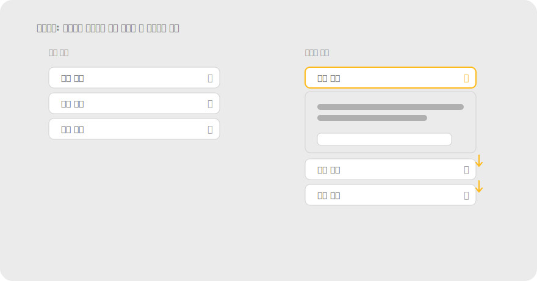

**레퍼런스**

- NN/g (영상) — Common Fate: https://www.nngroup.com/videos/common-fate-gestalt/
- IxDF — Law of Common Fate: https://www.interaction-design.org/literature/topics/law-of-common-fate
- Material Design — Motion: https://m3.material.io/styles/motion/overview
- WCAG 2.2 — Animation from Interactions 2.3.3: https://www.w3.org/WAI/WCAG22/Understanding/animation-from-interactions

**체크리스트**

- [ ] 관련 요소들이 트랜지션에서 같은 방향·같은 속도로 움직이는가?
- [ ] 무관한 요소가 우연히 같이 움직여 잘못 묶이지 않는가?
- [ ] prefers-reduced-motion 사용자에게 대체 모션(페이드)이 적용되는가?
- [ ] 모션 시간(200–300ms)·이징(ease-in-out)이 시스템 전체에서 일관되는가?
- [ ] Sticky/parallax 등 다른 운명의 요소가 의도된 의미를 가지는가?

---

### 2.9 대칭과 질서 Symmetry / Prägnanz

**정의** — 사람은 대상을 가능한 한 단순하고 대칭적인 형태로 지각한다. 떨어져 있어도 대칭을 이루는 요소들을 하나의 정돈된 전체로 본다.

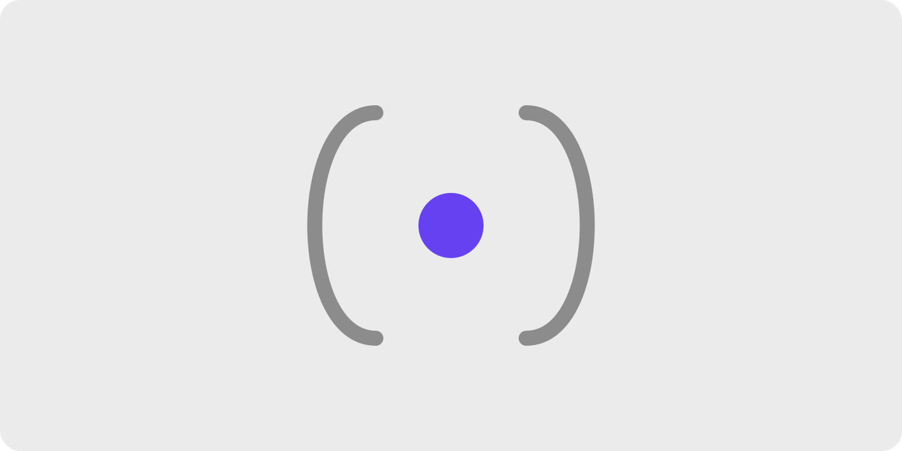
> 대칭 배치된 괄호/요소가 하나의 단위로 묶여 보이는 예시, 또는 균형 잡힌 그리드 레이아웃 한 장.

**왜 (인지 원리)**

- 1장 프레그난츠(단순성)가 형태 차원에서 발현된 모습. 복잡한 배열도 뇌는 "가장 단순하고 균형 잡힌 해석"으로 정리한다.
- **대칭은 시각 무게를 즉시 계산** — 좌우 대칭이면 안정·신뢰·격식. 비대칭은 동적·실험적·캐주얼. 브랜드 톤과 매칭되어야 함.
- **수학적 대칭**(완벽한 거울)은 정적·딱딱함. **광학적 대칭**(시각 무게 균형)은 살아 있는 균형 — 종종 비대칭으로 더 균형감을 줌(예: 큰 사진 옆 작은 텍스트 블록 3개).
- **그리드의 신뢰감** — 일관된 그리드와 정렬은 "정돈됨 = 통제력 = 신뢰감" 신호. 금융·정부·B2B 서비스에서 특히 그리드 일관성이 중요.
- 한계 — 과한 대칭은 단조롭고 위계가 사라짐. 강조해야 할 요소(추천 플랜·주요 CTA)는 의도적으로 대칭을 깨야 figure로 떠오름.

**현장 적용 패턴**

*그리드 시스템*

- 12-column 또는 16-column 그리드: 가장 유연. 1/2, 1/3, 1/4, 1/6 분할 모두 가능.
- Baseline grid(수직 리듬): 모든 텍스트가 일정 간격(예: 4px) 베이스라인에 정렬 → 페이지가 한 음악처럼 흐름.
- Modular scale: 폰트 크기·간격이 수학적 비례(1.125, 1.25, 1.5) → 자동 시각 조화.
- 8pt spacing system: 모든 여백·크기를 8의 배수로 → 자동 그리드 정렬.

*레이아웃 균형*

- 대칭 균형: 중심축 좌우가 거울 — 정적·격식. 결혼식 청첩장, 공식 문서.
- 비대칭 균형: 시각 무게가 다른 요소로 균형 — 동적·현대적. 매거진 레이아웃.
- 방사형 균형: 중심에서 바깥으로 — 시계, 차트 일부.
- 시각 무게 계산: 큰 것·진한 것·복잡한 것·따뜻한 색이 무겁다. 작은 액센트 색 하나로 큰 회색 영역과 균형 가능.

*가격표·플랜 비교*

- 3컬럼 대칭 + 중앙 추천 강조: 완벽 대칭에서 한 곳만 깨기 → 추천이 figure로 떠오름.
- 비교 표: 행 정렬(연속성) + 열 폭 통일 → 비교 가능성.
- 추천 컬럼: 살짝 더 크게(scale 1.05) + 색 테두리 + "추천" 뱃지 → 비대칭으로 강조.

*Two-pane / 다단 레이아웃*

- Email/메신저(좌 리스트 + 우 상세): 좌측 1/3 + 우측 2/3 비율이 일반적. 1:1은 정적.
- 대시보드 사이드바: 좁은 고정 폭(240–320px) + 가변 메인.
- 편집기(좌: 파일 트리 + 중: 에디터 + 우: 사이드패널): 3분할.

*카드 그리드*

- 카드 비율 통일(16:9, 4:3, 1:1) — 한 그리드 안에서 한 비율 유지.
- 카드 폭 = 컬럼 폭의 배수 → 자동으로 격자에 맞음.
- 카드 그림자·테두리·라운드 통일 → 시스템 일관성.

*타이포그래피 균형*

- Optical leading(line-height): 본문 1.5–1.6, 제목 1.2–1.3 — 시각적 균형.
- Justification: 양 끝 정렬(justify)은 단어 사이 간격이 들쭉날쭉해서 보통 좌측 정렬 권장.
- 단(column) 폭: 50–75자(영문 기준) — 너무 넓으면 다음 줄 찾기 어려움.
- 제목과 본문 가운데 정렬 vs 좌측 정렬: 짧은 헤드라인은 가운데, 긴 본문은 좌측.

*아이콘·일러스트 균형*

- Optical centering: 기하학적 중심과 시각적 중심이 다름. 삼각형은 기하 중심에 두면 위로 치우쳐 보임 → 살짝 아래로 보정.
- 아이콘 grid(예: 24×24 frame + 20×20 keyline) — 모든 아이콘이 같은 시각 무게.
- Heading + 아이콘 정렬: 글자의 cap-height와 아이콘의 시각 중심을 맞춤.

*단순화 (프레그난츠 응용)*

- 불필요한 장식 제거 — 핵심 구조가 또렷해짐. 미니멀리즘이 신뢰감을 주는 이유.
- 색 팔레트 축소: 1 액센트 + 1 보조 + 회색 5단계 → 위계 명확.
- 폰트 1–2개만 사용 — sans + serif 조합이 흔함.
- 복잡한 차트보다 단순한 막대·선 차트 — 데이터 잉크 비율(Tufte) ↑.

**다른 법칙과의 상호작용**

- **1장 프레그난츠의 응용**: 모든 게슈탈트 법칙이 단순성으로 수렴 — 대칭은 그 시각적 표현.
- **위계와 갈등**: 완벽 대칭은 위계 소실. 강조하려면 의도적으로 대칭을 깨야 함.
- **연속성과 결합**: 정렬된 + 대칭적 = 시선 흐름이 매우 매끄러움.
- **비대칭 균형**: 시각 무게가 다르면 위치·크기로 균형 — 종종 더 흥미로움.

> **예시 데모** — [SVG 미리보기](./assets/examples/02-9-symmetry-pricing.svg) · [HTML 데모](./assets/examples/02-9-symmetry-pricing.html)
>
> 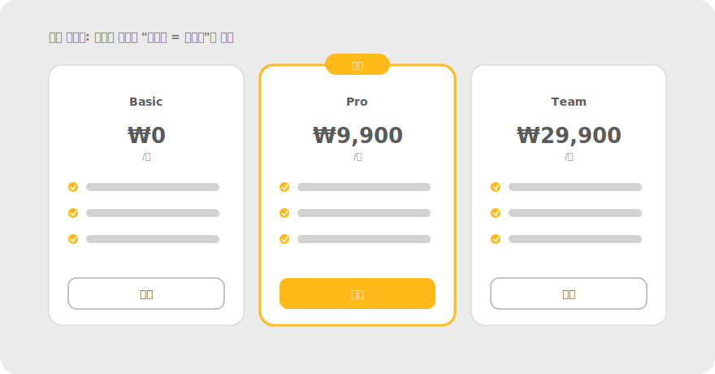

**레퍼런스**

- IxDF — Part 3 (Prägnanz 포함): https://www.interaction-design.org/literature/article/the-laws-of-figure-ground-praegnanz-closure-and-common-fate-gestalt-principles-3
- Wagemans et al. (2012) Part II — 프레그난츠/단순성 원리: https://www.ncbi.nlm.nih.gov/pmc/articles/PMC3728284/
- Tufte, E. (1983). The Visual Display of Quantitative Information — 데이터 잉크 비율.
- Material Design — Layout grid: https://m3.material.io/foundations/layout/applying-layout/window-size-classes
- 8pt Grid System (Bryn Jackson): https://spec.fm/specifics/8-pt-grid

**체크리스트**

- [ ] 레이아웃이 일관된 그리드(4/8pt)와 정렬을 따르는가?
- [ ] 시각 무게가 좌우 또는 방사로 균형 잡혀 있는가?
- [ ] 강조할 요소(추천 플랜·CTA)는 의도적으로 대칭을 깨서 figure로 떠오르는가?
- [ ] 카드 비율·라운드·shadow·간격이 시스템 토큰으로 통일됐는가?
- [ ] 폰트·색·아이콘 스타일이 1–2가지로 압축됐는가? (프레그난츠)
- [ ] 불필요한 장식 요소가 핵심 구조를 흐리지 않는가?
- [ ] 아이콘의 optical center가 보정됐는가? (특히 삼각형·재생 버튼)

---

## 3. 시각 위계 Visual Hierarchy

게슈탈트 법칙들은 결국 **"무엇이 한 묶음이고, 그중 무엇이 더 중요한가"** 를 설계하는 도구다. 그룹핑은 곧 우선순위 신호다.

**위계를 만드는 레버**

- **크기/굵기**: 큰 것·굵은 것이 먼저 읽힌다.
- **대비/색**: 전경-배경 + 유사성으로 강조점을 만든다.
- **여백**: 근접성 + 공통영역으로 묶고 분리한다.
- **위치**: 상단·좌측이 스캔 우선순위가 높다(읽기 방향).

**스캔 패턴과의 연결**

- 텍스트 중심 화면은 **F-패턴**, 시각 요소가 많은 화면은 **Z-패턴/레이어케이크 패턴**으로 스캔되는 경향. 위계 설계 시 첫 시선이 닿는 지점에 핵심을 배치한다.
- NN/g — The Gestalt Principles for UI Design (위계·스케일·대비 종합): https://www.nngroup.com/videos/the-gestalt-principles-intro/
- NN/g — Visual Design 용어집/치트시트: https://www.nngroup.com/articles/visual-design-cheat-sheet/

> 본인 작업 화면 한 장에 그룹 경계를 색 오버레이로 그려 "어떤 법칙이 어디서 작동하는지" 분석 주석을 단 이미지로 교체하세요 (`assets/03-hierarchy-annotated.png`).

---

## 4. 화면 적용 케이스 스터디

> 핵심: **실제 화면엔 여러 법칙이 동시에 작동한다.** 단일 법칙으로 보지 말고 "겹쳐 읽는" 연습을 한다.

### 4.1 카드 레이아웃
- 작동 법칙: **근접성**(카드 내부 요소) + **공통 영역**(카드 배경/테두리) + **유사성**(카드 구조 통일)
- 체크: 카드 내부는 가깝게, 카드 사이는 멀게. 카드 구조는 통일.

### 4.2 폼 / 입력
- 작동 법칙: **근접성**(라벨-필드) + **연결성/공통영역**(섹션 구획)
- 체크: 라벨이 올바른 필드에 붙었는가. 섹션 간 간격이 충분한가.

### 4.3 내비게이션 / 탭
- 작동 법칙: **유사성**(탭 형태 통일) + **전경-배경**(현재 탭 강조) + **공동운명**(전환 모션)
- 체크: 현재 위치가 전경으로 떠오르는가.

### 4.4 가격표 / 플랜 비교
- 작동 법칙: **유사성**(열 구조 통일) + **대칭**(균형) + **전경-배경**(추천 플랜 강조)
- 체크: 추천 플랜이 전경으로 분리되는가. 비교 항목이 행으로 정렬(연속성)되는가.

### 4.5 이벤트 페이지 *(실무 직결 — 직접 사례 채우기)*
- 작동 법칙: **전경-배경**(혜택/CTA 강조) + **근접성**(혜택 묶음) + **유사성**(반복 모듈)

> 본인이 만든 이벤트 페이지 캡처 + 그룹 분석 주석으로 교체하세요 (`assets/04-5-event-page.png`).

---

## 5. 안티패턴 / 흔한 실수

각 항목은 **✗ 잘못된 예 ↔ ✓ 바로잡은 예** 비교 이미지가 함께 있습니다.

### 5.1 어중간한 간격
그룹 내부와 그룹 사이 간격 차이가 작아 묶음이 모호해진다. → **간격 대비를 키운다.**

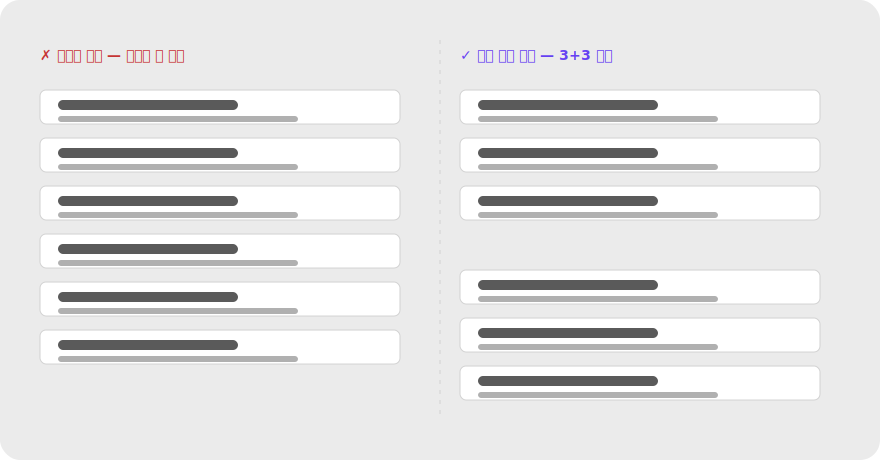

### 5.2 유사성 과용
모든 버튼이 같은 색·크기 → 위계가 사라져 주요 행동이 안 보인다. → **주요 CTA만 채움 색·다른 형태로 차별화.**

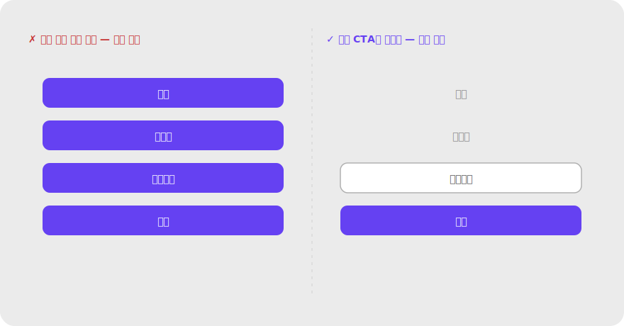

### 5.3 상자 천지
모든 그룹에 테두리·박스를 두르면 시각 복잡도가 폭발하고, 정작 중요한 위계가 사라진다. → **여백 → 배경색 → 테두리 순으로 가장 약한 신호부터 시도한다.**

이 안티패턴은 한 가지 모습이 아니다. 자주 보는 변형들:

- **모든 섹션 박스화** — 페이지 안의 모든 그룹에 카드/테두리. 위계가 사라져 어디부터 봐야 할지 모름.
- **중첩 카드(card-in-card)** — 카드 안에 또 카드, 또 그 안에 입력 박스. 깊이감이 과해져 "지금 내가 어느 계층에 있는지" 인지 비용 증가.
- **모든 폼 필드를 카드로 감싸기** — 라벨+필드 하나하나가 카드. 입력해야 할 흐름이 보이지 않고 폼이 산만해 보임.
- **리스트 항목마다 테두리** — `<li>` 하나하나에 박스. 리스트라는 "이미 묶인 구조"에 박스가 중복 신호로 작용.
- **섹션마다 다른 배경색** — 영역을 나누려고 배경색을 다르게 쓰면 색이 의미 없이 늘어나 색 위계까지 무너짐.
- **불필요한 디바이더(divider)** — 가로선이 너무 자주 나오면 콘텐츠가 토막 나 흐름이 끊김.

**처방** — 여백으로 묶을 수 있다면 박스를 쓰지 않는다. 정말 필요할 때만 ① 옅은 배경색 → ② 가는 테두리 순으로, 단 한 계층만 사용한다.

#### (a) 너무 많은 카드 → 여백 위주

#### (b) 중첩 카드 → 단일 카드 + 섹션 여백
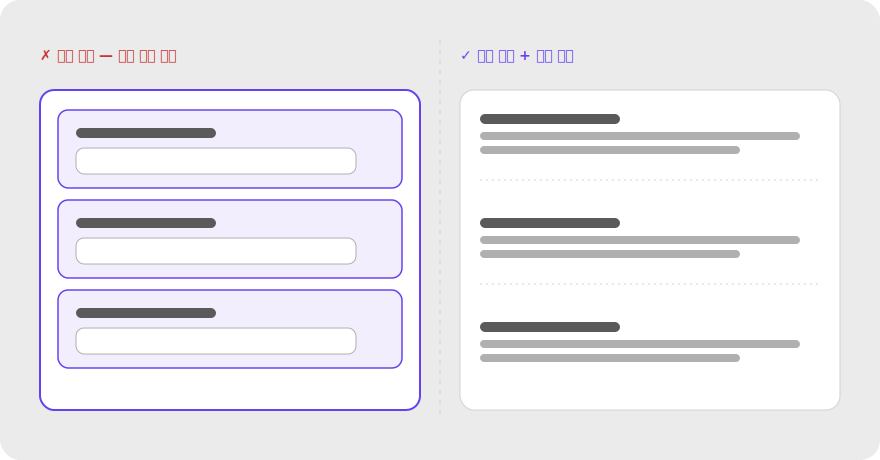

#### (c) 필드마다 카드 → 라벨 + 필드만
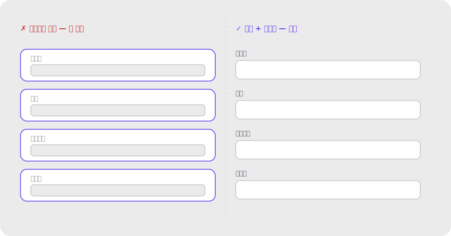

### 5.4 전부 강조 = 강조 없음
강조 요소가 너무 많으면 전경이 사라진다. → **화면당 핵심 전경은 1~2개.**

### 5.5 과한 폐쇄성 / 생략
정보가 너무 부족하면 형태 인식에 실패한다. → **윤곽을 암시할 최소 단서는 남긴다.**

### 5.6 배경 위 저대비 텍스트
전경-배경 분리가 깨지면 가독성이 무너진다. → **그라디언트 오버레이/그림자로 대비 보강.**

---

## 6. 실무 체크리스트

설계 리뷰할 때 이 한 페이지만 펼쳐 쓴다.

- [ ] **근접성** — 관련 요소는 가깝게, 무관 요소는 멀게?
- [ ] **유사성** — 같은 기능 = 비슷한 모양? 주요 CTA는 차별화?
- [ ] **공통 영역** — 경계 전에 여백으로 묶을 수 있나? 박스 남용 아닌가?
- [ ] **연결성** — 흐름/관계를 선으로 보여줄 수 있나? 의도치 않은 연결 없나?
- [ ] **연속성** — 정렬 축이 명확해 시선 동선이 매끄럽나?
- [ ] **폐쇄성** — 형태 인식에 충분한 단서? 과한 생략 아닌가?
- [ ] **전경-배경** — 지금 봐야 할 것이 분명? 배경 위 텍스트 대비 충분?
- [ ] **공동운명** — 관련 요소가 같은 모션? 무관 요소가 잘못 묶이지 않나?
- [ ] **대칭/질서** — 일관된 그리드? 장식이 구조를 흐리지 않나?
- [ ] **위계** — 첫 시선 지점에 핵심이 있나? 강조 전경이 1~2개로 절제됐나?

---

## 7. 참고 자료

### 원전 (이론의 뿌리)
- **Wertheimer, M. (1923). Laws of Organization in Perceptual Forms.** — 그룹핑 법칙의 출발점. 영어 번역본 무료 공개(Classics in the History of Psychology):
  http://psychclassics.yorku.ca/Wertheimer/Forms/forms.htm

### 현대 학술 종합 리뷰 (깊이의 핵심 · 오픈 액세스)
- **Wagemans et al. (2012). A century of Gestalt psychology in visual perception: I. Perceptual grouping and figure–ground organization.** *Psychological Bulletin.* — 그룹핑·전경-배경 100년 연구 정리. PMC 무료:
  https://www.ncbi.nlm.nih.gov/pmc/articles/PMC3482144/
- **Wagemans et al. (2012). II. Conceptual and theoretical foundations.** — 프레그난츠/단순성 등 이론적 기초:
  https://www.ncbi.nlm.nih.gov/pmc/articles/PMC3728284/

### 실무 (UI/UX 적용)
- **Nielsen Norman Group — Gestalt 토픽 허브**: https://www.nngroup.com/topic/gestalt/
  - Proximity: https://www.nngroup.com/articles/gestalt-proximity/
  - Similarity: https://www.nngroup.com/articles/gestalt-similarity/
  - Common Region: https://www.nngroup.com/articles/common-region/
  - Closure: https://www.nngroup.com/articles/principle-closure/
  - 영상 모음(Connectedness/Continuation/Figure-Ground/Common Fate): 위 토픽 허브에서 접근
  - 종합 영상 — The Gestalt Principles for UI Design: https://www.nngroup.com/videos/the-gestalt-principles-intro/
  - Visual Design 치트시트/용어집: https://www.nngroup.com/articles/visual-design-cheat-sheet/
- **Interaction Design Foundation (IxDF)**
  - Gestalt Principles 토픽: https://www.interaction-design.org/literature/topics/gestalt-principles
  - Part 2 (Proximity·Connectedness·Continuation): https://www.interaction-design.org/literature/article/laws-of-proximity-uniform-connectedness-and-continuation-gestalt-principles-2
  - Part 3 (Figure-Ground·Prägnanz·Closure·Common Fate): https://www.interaction-design.org/literature/article/the-laws-of-figure-ground-praegnanz-closure-and-common-fate-gestalt-principles-3
  - Law of Closure: https://www.interaction-design.org/literature/topics/law-of-closure
  - Law of Common Fate: https://www.interaction-design.org/literature/topics/law-of-common-fate

> ※ 위 외부 페이지의 예시 스크린샷을 외부 공유 문서에 그대로 옮기는 것은 저작권 문제가 될 수 있음. 개인 학습용 캡처는 자유롭게, 공유 시에는 직접 제작 다이어그램으로 대체할 것.

---

## 8. 부록: 용어집

- **게슈탈트(Gestalt)** — 형태·구조·전체. 부분의 단순 합과 다른 통합된 지각.
- **프레그난츠(Prägnanz)** — 단순성의 법칙. 뇌가 가능한 한 단순·안정적 형태로 지각하려는 상위 경향.
- **그룹핑(perceptual grouping)** — 개별 요소를 묶어 단위로 지각하는 과정.
- **전경-배경(figure–ground)** — 장면을 주목 대상과 바탕으로 분리하는 지각.
- **시각 위계(visual hierarchy)** — 요소의 중요도를 시각적 차이로 설계해 시선 순서를 만드는 것.
- **F-패턴 / Z-패턴** — 사용자가 화면을 스캔하는 전형적 시선 경로.

---

*문서 끝 · 갱신 시 버전과 날짜를 상단에 기록할 것.*
