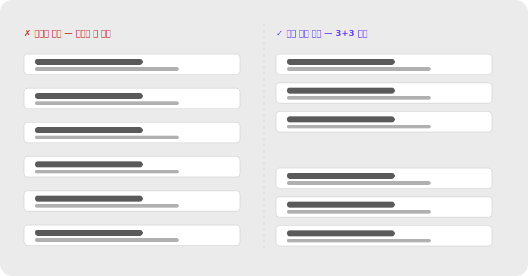
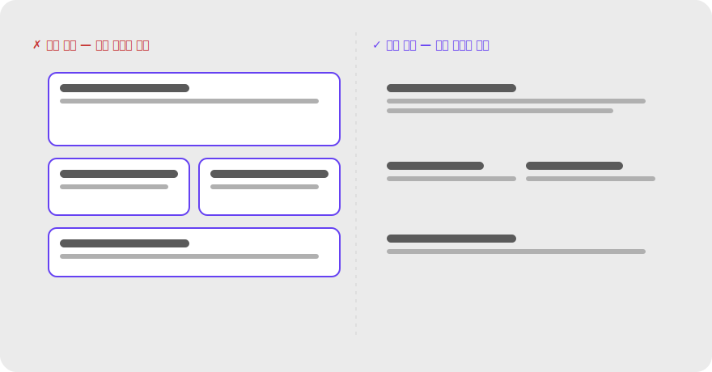
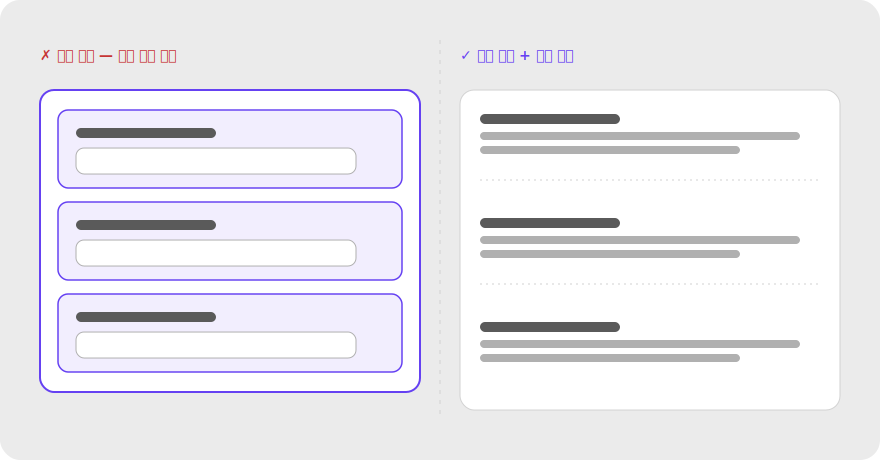
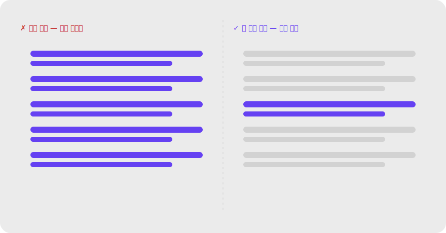
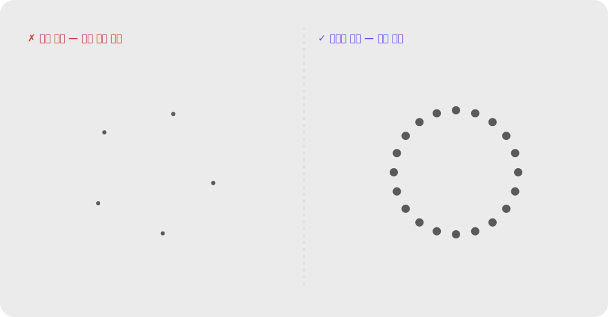
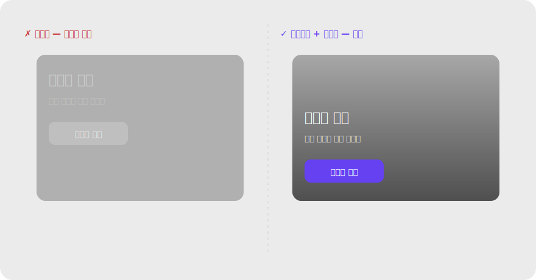

# 5. 안티패턴 / 흔한 실수

각 항목은 **✗ 잘못된 예 ↔ ✓ 바로잡은 예** 비교 이미지가 함께 있습니다.

### 5.1 어중간한 간격
그룹 내부와 그룹 사이 간격 차이가 작아 묶음이 모호해진다. → **간격 대비를 키운다.**

### 5.2 유사성 과용
모든 버튼이 같은 색·크기 → 위계가 사라져 주요 행동이 안 보인다. → **주요 CTA만 채움 색·다른 형태로 차별화.**

### 5.3 상자 천지
모든 그룹에 테두리·박스를 두르면 시각 복잡도가 폭발하고, 정작 중요한 위계가 사라진다. → **여백 → 배경색 → 테두리 순으로 가장 약한 신호부터 시도한다.**

이 안티패턴은 한 가지 모습이 아니다. 자주 보는 변형들:

- **모든 섹션 박스화** — 페이지 안의 모든 그룹에 카드/테두리. 위계가 사라져 어디부터 봐야 할지 모름.
- **중첩 카드(card-in-card)** — 카드 안에 또 카드, 또 그 안에 입력 박스. 깊이감이 과해져 "지금 내가 어느 계층에 있는지" 인지 비용 증가.
- **모든 폼 필드를 카드로 감싸기** — 라벨+필드 하나하나가 카드. 입력해야 할 흐름이 보이지 않고 폼이 산만해 보임.
- **리스트 항목마다 테두리** — `<li>` 하나하나에 박스. 리스트라는 "이미 묶인 구조"에 박스가 중복 신호로 작용.
- **섹션마다 다른 배경색** — 영역을 나누려고 배경색을 다르게 쓰면 색이 의미 없이 늘어나 색 위계까지 무너짐.
- **불필요한 디바이더(divider)** — 가로선이 너무 자주 나오면 콘텐츠가 토막 나 흐름이 끊김.

**처방** — 여백으로 묶을 수 있다면 박스를 쓰지 않는다. 정말 필요할 때만 ① 옅은 배경색 → ② 가는 테두리 순으로, 단 한 계층만 사용한다.

#### (a) 너무 많은 카드 → 여백 위주

#### (b) 중첩 카드 → 단일 카드 + 섹션 여백

#### (c) 필드마다 카드 → 라벨 + 필드만

### 5.4 전부 강조 = 강조 없음
강조 요소가 너무 많으면 전경이 사라진다. → **화면당 핵심 전경은 1~2개.**

### 5.5 과한 폐쇄성 / 생략
정보가 너무 부족하면 형태 인식에 실패한다. → **윤곽을 암시할 최소 단서는 남긴다.**

### 5.6 배경 위 저대비 텍스트
전경-배경 분리가 깨지면 가독성이 무너진다. → **그라디언트 오버레이/그림자로 대비 보강.**

---
