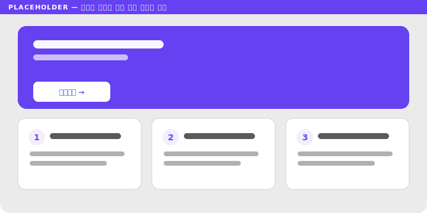

# 4. 화면 적용 케이스 스터디

> 핵심: **실제 화면엔 여러 법칙이 동시에 작동한다.** 단일 법칙으로 보지 말고 "겹쳐 읽는" 연습을 한다.

### 4.1 카드 레이아웃
- 작동 법칙: **근접성**(카드 내부 요소) + **공통 영역**(카드 배경/테두리) + **유사성**(카드 구조 통일)
- 체크: 카드 내부는 가깝게, 카드 사이는 멀게. 카드 구조는 통일.

### 4.2 폼 / 입력
- 작동 법칙: **근접성**(라벨-필드) + **연결성/공통영역**(섹션 구획)
- 체크: 라벨이 올바른 필드에 붙었는가. 섹션 간 간격이 충분한가.

### 4.3 내비게이션 / 탭
- 작동 법칙: **유사성**(탭 형태 통일) + **전경-배경**(현재 탭 강조) + **공동운명**(전환 모션)
- 체크: 현재 위치가 전경으로 떠오르는가.

### 4.4 가격표 / 플랜 비교
- 작동 법칙: **유사성**(열 구조 통일) + **대칭**(균형) + **전경-배경**(추천 플랜 강조)
- 체크: 추천 플랜이 전경으로 분리되는가. 비교 항목이 행으로 정렬(연속성)되는가.

### 4.5 이벤트 페이지 *(실무 직결 — 직접 사례 채우기)*
- 작동 법칙: **전경-배경**(혜택/CTA 강조) + **근접성**(혜택 묶음) + **유사성**(반복 모듈)

> 본인이 만든 이벤트 페이지 캡처 + 그룹 분석 주석으로 교체하세요 (`assets/04-5-event-page.svg`).

---
