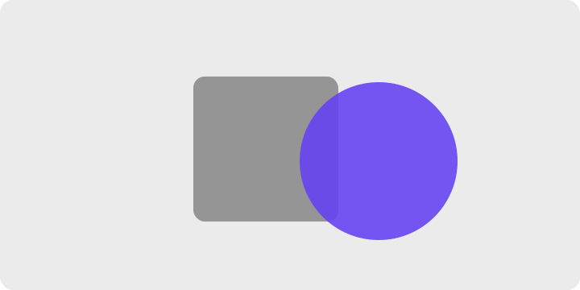

# 게슈탈트 시지각 원리 → UI/UX 적용 레퍼런스

> **목적** — 게슈탈트 시지각 이론을 깊게 이해하고, 그 원리를 화면 설계(레이아웃·그룹핑·시각 위계)에 적용하기 위한 개인 학습/작업 레퍼런스.
> **작성일** — 2026-06-10 · **버전** — v0.4 · **관리** — GitHub private repo (이미지는 `assets/`에 상대경로로 관리)
> **변경** — v0.4: PNG 제거 SVG-only 통일, 각 법칙별 보조 케이스 이미지 9장 추가 (비율·위계·elevation·F-패턴·skeleton·상태·tab slide·8pt 그리드) · v0.3: 9개 법칙별 인지 원리 심화 + 카테고리별 적용 패턴(폼·내비·차트·모바일·모션) + 법칙 간 상호작용 추가 · v0.2: 메인 컬러 `#6541F2` 통일, UI/UX 예시 + 안티패턴 비교 이미지 추가

---

---

## 1. 게슈탈트 심리학 개요

**한 줄 정의** — "전체는 부분의 합과 다르다(The whole is different from the sum of its parts)." 우리 시각 시스템은 개별 요소를 따로 보지 않고, 의식하기 전에 먼저 **묶고·분리하고·완성해서** 의미 있는 구조로 지각한다.

**배경** — 1910~30년대 독일에서 막스 베르트하이머(Max Wertheimer), 쿠르트 코프카(Kurt Koffka), 볼프강 쾰러(Wolfgang Köhler)가 정립했다. "Gestalt"는 독일어로 형태·구조·전체를 뜻한다. 이들은 인간이 무질서 속에서 어떻게 질서를 찾는지를 연구했고, 그 결과가 오늘날 UI 설계의 기반이 되는 그룹핑 법칙들이다.

### 프레그난츠 법칙 (Law of Prägnanz) — 모든 법칙의 상위 원리

개별 법칙(근접성·유사성 등)을 외우기 전에 이걸 먼저 잡아야 한다. **프레그난츠(= 단순성의 법칙, the law of simplicity / minimum principle)** 는 이렇게 말한다:

> 뇌는 주어진 자극을 **가능한 한 가장 단순하고 안정적인 형태로** 조직하려 한다.

즉 개별 그룹핑 법칙들은 제각각 따로 있는 규칙이 아니라, "지각을 최대한 단순하게 만들려는" 하나의 경향이 상황별로 발현된 것이다. 근접성도, 유사성도, 폐쇄성도 결국 "이렇게 묶는 게 더 단순하니까" 일어난다.

**왜 UI/UX에서 중요한가**

- 사용자는 화면을 **읽기 전에 스캔**한다. 그 스캔 단계에서 무의식적으로 그룹을 만든다.
- 디자이너가 그룹핑 신호를 잘 주면 → 사용자의 **인지 부하**가 줄고, 의미가 빠르게 전달된다.
- 신호가 모호하면 → 뇌가 "잘못된 그룹"을 만들어 오해·이탈로 이어진다.
- 핵심: **간격·정렬·색·테두리 같은 작은 선택이 "무엇이 한 묶음인지"를 결정**한다.

> 겹친 사각형과 원이 하나의 복잡한 윤곽이 아니라 두 개의 단순한 도형으로 분리되어 보인다 — 단순성으로 향하는 지각의 기본 경향.

---

---

## 2. 핵심 그룹핑 법칙
