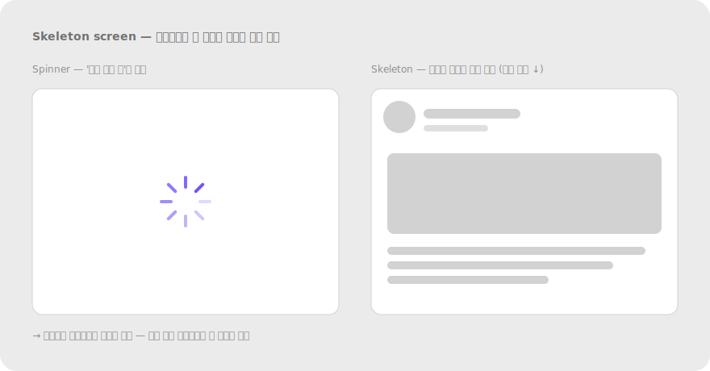

# 2.6 폐쇄성 Closure

**정의** — 외부 자극이 어떤 형태와 부분적으로 맞아떨어지면, 사람은 빈 곳을 스스로 채워 완성된 형태로 지각한다.

> 끊긴 원/사각형이 완성된 도형으로 보이는 예시, 또는 세 개의 팩맨 모양이 (실재하지 않는) 삼각형을 만드는 카니자 삼각형.

**왜 (인지 원리)**

- Kanizsa (1955)의 환영 삼각형 실험이 대표 예시 — 세 개의 부분만으로도 뇌가 가운데 흰 삼각형을 "본다". 이 인식은 V2 영역에서 100ms 이내에 자동 발생.
- **시각 정보가 부족해도 뇌는 환경을 이해하려 빈틈을 메운다**. 다만 **올바른 경계를 만들 충분한 단서가 있을 때만** 작동한다(Wagemans, 2012). 단서가 너무 적으면 인식 실패.
- **선험 지식의 영향** — 사용자가 익숙한 형태(원·삼각형·로고)일수록 더 적은 단서로 폐쇄됨. 처음 보는 형태는 단서가 많아야 닫힘.
- 폐쇄성은 **자동·전주의(preattentive)** 단계에서 작동 — 사용자가 의식적으로 "이건 무슨 모양?" 추론하지 않아도 즉시 완성된 형태로 인식.
- 한계 — ① 단서가 너무 적으면 닫히지 않음 ② 동시에 여러 닫힘 후보가 있으면 모호성 발생 ③ 회전·왜곡된 부분 단서는 폐쇄 실패율 ↑.

**현장 적용 패턴**

*로고·아이콘 디자인*

- FedEx 로고의 숨겨진 화살표 — E와 x 사이 음각.
- WWF 판다 — 부분만으로 판다 전체 인식.
- IBM 로고 — 8개 가로선만으로 글자 형태 완성.
- 미니멀 아이콘: 최소한의 선으로 형태 암시(stroke 아이콘이 filled보다 더 폐쇄성 활용).
- 주의: 너무 추상화하면 인식 실패. A/B 테스트로 "이게 무엇인지 5초 안에 말할 수 있나" 검증.

*"더 있음" 암시*

- 리스트 아래쪽 fade gradient(투명도 → 배경색) → 스크롤하면 더 있음.
- 캐러셀 가장자리에서 다음 카드 일부 잘라 보임 → 가로 스크롤 암시(폐쇄성 + 연속성).
- 드롭다운 아래쪽 절단 + opacity → 펼치면 더 많은 옵션.
- "3개 더 보기" 같은 명시적 텍스트보다 시각 폐쇄성 단서가 더 자연스러움(클릭 없이 인지).

*Skeleton screen·로딩*

- Skeleton 콘텐츠는 폐쇄성으로 "곧 채워질 형태"를 미리 보여줘 대기 시간 체감 단축.
- 제목 자리 → 회색 가로 막대, 이미지 자리 → 회색 사각형, 본문 → 여러 줄 회색 막대 — 사용자는 "여기에 콘텐츠가 올 것"을 자동 추론.
- Skeleton vs spinner: skeleton이 폐쇄성으로 "구조"를 알리므로 더 빠른 인지.

> 
> *Skeleton vs Spinner — 폐쇄성으로 구조 미리 보임*

*아바타·이니셜 fallback*

- 프로필 이미지 없을 때 원 안 이니셜 — 원은 닫힌 형태로 "사람의 정체"를 채움.
- 단순 도형 아바타도 동일.

*Progress·상태 표시*

- Circular progress ring: 호의 일부만 보여도 "원이 완성될 예정"을 인지(폐쇄성으로 진행률 직관화).
- 단계별 체크박스: 완료 체크마크가 원 안에 닫혀 "완료된 단위"로 인식.
- Donut chart 안 가운데 숫자 — 빈 가운데가 "닫힌 영역"으로 인지되어 숫자가 강조됨.

*레이아웃·이미지*

- 히어로 이미지가 컨테이너 밖으로 살짝 잘림 — 사용자가 마음속에서 전체 이미지를 완성.
- 카드 이미지 상단을 둥글게 잘라 카드 모양과 결합 — 닫힌 단위로 인지.
- 히트맵·차트 가장자리 잘림 — 데이터가 더 있음 암시.

*UI 컴포넌트*

- Tab 컨테이너의 active 탭이 아래로 "이어진" 영역(밑변 없는 박스) → 콘텐츠가 탭에 속함을 폐쇄로 형성.
- Tooltip의 화살표 — 트리거에 "연결되어 있음"을 닫힌 도형으로 표현.
- 햄버거 메뉴 아이콘 — 세 가로선만으로 "메뉴 목록" 형태 인식.
- 햄버거 메뉴는 폐쇄성이 약해 학습이 필요(인지 부담) — "MENU" 라벨 병기 권장.

**다른 법칙과의 상호작용**

- **유사성·연속성과 결합**: 부분 단서가 같은 모양·매끄럽게 이어지면 폐쇄가 더 안정적.
- **전경-배경 의존**: 닫힐 형태가 figure로 인지되어야 작동. 배경이 너무 복잡하면 폐쇄 신호 약화.
- **과한 생략은 안티패턴(§5.5)** — 핵심 단서까지 빼면 인식 실패. 가독성 테스트 필수.

> **예시 데모** — [SVG 미리보기](../assets/examples/02-6-closure-readmore.svg) · [HTML 데모](../assets/examples/02-6-closure-readmore.html)
>
> 

**레퍼런스**

- NN/g — Principle of Closure in Visual Design: https://www.nngroup.com/articles/principle-closure/
- IxDF — Law of Closure: https://www.interaction-design.org/literature/topics/law-of-closure
- Kanizsa, G. (1955). Margini quasi-percettivi in campi con stimolazione omogenea. *Rivista di Psicologia* — 환영 윤곽선 원전.

**체크리스트**

- [ ] 형태를 완성하기에 충분한 단서를 남겼는가? (과한 생략 금지)
- [ ] 잘린 콘텐츠가 "더 있음"을 자연스럽게 암시하는가?
- [ ] skeleton screen이 실제 콘텐츠 구조를 미리 보여주는가?
- [ ] 아이콘이 5초 인식 테스트를 통과하는가?
- [ ] 닫힐 형태가 figure로 명확히 떠오르는가? (배경이 방해하지 않음)

---
