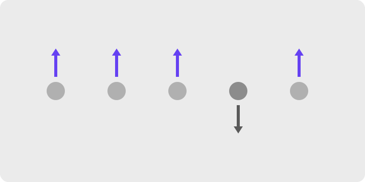
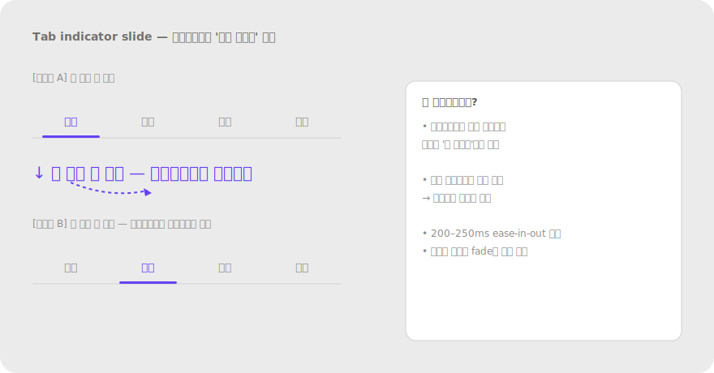
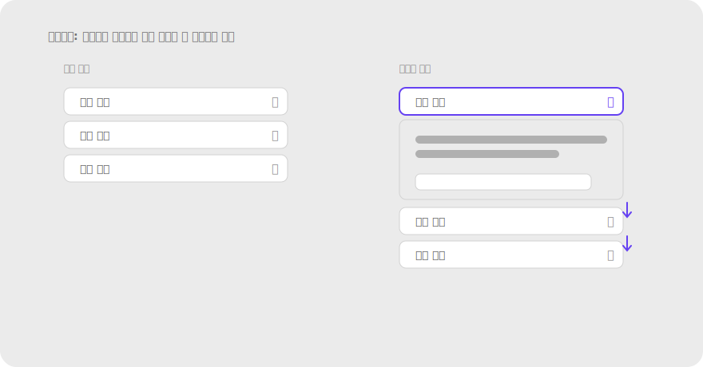

# 2.8 공동운명 Common Fate

**정의** — 같은 방향·같은 속도로 함께 움직이는 요소들은 한 그룹으로 지각된다. 가만히 있거나 다르게 움직이는 요소와는 구별된다.

> 정적 매체로는 표현이 어려우니, 함께 펼쳐지는 서브메뉴/아코디언의 전·후 프레임 또는 움직임 방향 화살표로 표현.

**왜 (인지 원리)**

- 같은 방향·같은 속도로 움직이는 요소들은 강하게 묶인다. **시간 차원이 결합된 그룹핑 단서**라 시각 디자인에서 자주 잊히지만, 인터랙티브 UI에서는 가장 강력한 신호 중 하나.
- 자연계에서 함께 움직이는 것은 대개 같은 객체(예: 한 무리 새, 자동차 부품) → 시각 시스템이 이 통계 규칙을 학습.
- **모션 동기화 정확도** — 4–8 프레임(67–133ms) 이내 동기화면 같은 그룹으로 인식. 그 이상 어긋나면 별개로 분리.
- **공동운명의 응용 범위** — 펼침/접힘 애니메이션, 드래그 다중 선택, 페이지 전환, 모달 등장, 스크롤 시 sticky 요소가 함께 따라옴, 캐러셀 슬라이드.
- 한계 — 동시 움직임이 과하면 어지러움(motion sickness) 유발. `prefers-reduced-motion` 설정 사용자에 대해 모션 최소화 필수(WCAG 2.3.3).

**현장 적용 패턴**

*펼침·접힘*

- Accordion: 펼침 시 펼쳐진 콘텐츠와 그 아래 항목들이 같은 방향(아래)으로 함께 이동 → "한 시스템"임을 인지.
- Tree view 노드: 부모를 펼치면 자식들이 함께 등장, 접으면 함께 사라짐.
- 드롭다운 메뉴: 옵션들이 함께 펼쳐짐 — 한 메뉴 단위로 인식.
- 확장 가능 카드: 카드 자체가 확장되고 안의 추가 콘텐츠가 함께 등장.

*페이지·뷰 전환*

- iOS push transition: 새 화면이 오른쪽에서 슬라이드인 + 이전 화면이 왼쪽으로 슬라이드아웃 — "다음/이전"의 공간 메타포.
- Modal sheet: 아래에서 위로 슬라이드업 — bottom sheet의 위치 메타포.
- Hero(shared element) transition: 같은 요소가 화면 간에 연속 이동(iOS Photos에서 썸네일이 풀스크린으로).
- Tab 전환: 콘텐츠가 좌우로 슬라이드 — 같은 탭 시스템 안의 형제.

*드래그·다중 선택*

- 여러 항목 선택 후 드래그 시 모두 함께 이동 → "한 그룹"임을 시각화.
- 드래그 중인 요소가 다른 그룹 위로 호버하면 그 그룹이 함께 살짝 흔들리거나 색 변함 → drop target 신호.
- Sortable list: 한 아이템을 드래그하면 주변 아이템들이 자리를 비켜주는 모션.

*스크롤·sticky·parallax*

- Sticky header: 스크롤 시 콘텐츠는 위로, 헤더는 고정 → 헤더가 "다른 운명"으로 분리됨을 알림.
- Sticky table header/column: 표 스크롤 시 헤더만 고정.
- Parallax: 배경과 전경이 다른 속도 — 깊이감 표현이지만 과하면 멀미. 사용 시 prefers-reduced-motion 체크.
- "Reveal on scroll": 스크롤 시 여러 요소가 함께 페이드인 → 같은 콘텐츠 단위.

*알림·상태 변화*

- Toast 스택: 여러 토스트가 함께 위로 슬라이드해 새 토스트 자리 마련.
- Notification badge 카운트 변화: 숫자가 함께 페이드 또는 스케일.
- 로딩 → 콘텐츠 등장: skeleton이 페이드아웃 동시에 실제 콘텐츠가 페이드인.

*마이크로 인터랙션*

- 토글 스위치: 손잡이 이동과 배경색 변화가 동기화 → 한 단위.
- Tab indicator slide: 탭 누르면 밑줄 인디케이터가 미끄러져 이동 → 탭들이 한 시스템.
- Segmented control: active 영역이 옆 옵션으로 슬라이드.
- Loading dot 점프: 점 3개가 일정 간격으로 함께 튐 → "같은 로딩 시스템".

> 
> *Tab indicator slide — 인디케이터가 함께 이동*

*모바일 특화*

- Pull-to-refresh: 콘텐츠 전체가 함께 아래로 끌려옴 → "전체 새로고침" 메타포.
- Swipe gesture: 카드/리스트 항목 하나를 옆으로 밀면 그 항목의 액션 버튼들이 함께 등장.
- 키보드 등장 시 하단 fixed CTA가 함께 위로 → 가려지지 않게.

**다른 법칙과의 상호작용**

- **모든 단서를 압도할 수 있음**: 색·거리가 달라도 같이 움직이면 묶임. 정적 디자인의 그룹과 다른 모션 그룹을 만들 수 있어 강력.
- **연속성과 결합**: 모션 경로가 부드럽고 일관된 방향이면 그룹화 ↑↑.
- **전경-배경과 결합**: 함께 움직이는 요소는 함께 figure화될 수 있음.
- **과한 모션은 접근성 위반**: prefers-reduced-motion 사용자엔 페이드 등 약한 모션으로 대체.
- **비동기 모션은 잘못된 그룹 형성** — 무관한 요소가 우연히 같이 움직이면 사용자는 관련 있다고 오해.

> **예시 데모** — [SVG 미리보기](../assets/examples/02-8-common-fate-accordion.svg) · [HTML 데모](../assets/examples/02-8-common-fate-accordion.html)
>
> 

**레퍼런스**

- NN/g (영상) — Common Fate: https://www.nngroup.com/videos/common-fate-gestalt/
- IxDF — Law of Common Fate: https://www.interaction-design.org/literature/topics/law-of-common-fate
- Material Design — Motion: https://m3.material.io/styles/motion/overview
- WCAG 2.2 — Animation from Interactions 2.3.3: https://www.w3.org/WAI/WCAG22/Understanding/animation-from-interactions

**체크리스트**

- [ ] 관련 요소들이 트랜지션에서 같은 방향·같은 속도로 움직이는가?
- [ ] 무관한 요소가 우연히 같이 움직여 잘못 묶이지 않는가?
- [ ] prefers-reduced-motion 사용자에게 대체 모션(페이드)이 적용되는가?
- [ ] 모션 시간(200–300ms)·이징(ease-in-out)이 시스템 전체에서 일관되는가?
- [ ] Sticky/parallax 등 다른 운명의 요소가 의도된 의미를 가지는가?

---
