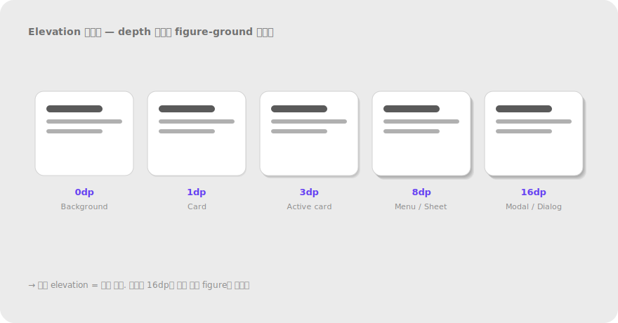

# 2.3 공통 영역 Common Region

**정의** — 하나의 경계(테두리·배경색·박스) 안에 있는 요소들은 한 그룹으로 지각된다. 20세기 후반에 추가된 법칙으로 UX 활용도가 매우 높다.

> 흩어진 점들 위에 박스(배경색 영역)를 씌우면, 박스 안 점들이 한 묶음으로 보인다. 근접성을 거스르고도 묶임이 만들어진다.

**왜 (인지 원리)**

- Palmer (1992)가 추가한 비교적 새로운 법칙. **이전 6개 법칙보다 우선순위가 높다** — 명시적 경계는 근접성·유사성을 모두 압도한다.
- 경계 신호 강도 위계(약→강): ① 배경색 tint → ② 가는 테두리(1px) → ③ 굵은 테두리 → ④ 그림자(elevation) → ⑤ 둘 이상 조합. **가장 약한 신호로 충분하면 거기서 멈춰야** 시각 복잡도 절약.
- 경계가 **너무 강하면** 안쪽 콘텐츠를 가둬버려 외부와 단절감이 과해진다(섬 효과). 카드 사이에 자연스러운 시선 흐름을 만들려면 경계는 최소화.
- **공통 영역의 함정** — 한 번 박스를 치면 시각적으로 "닫힌 단위"로 인지되므로, 그 단위가 의미적으로 결합도가 약하면 사용자는 "왜 묶였지?" 의문 → 인지 부하 증가.
- 모바일에서는 **카드 = 터치 가능 단위**라는 학습이 형성됨. 카드처럼 보이지만 클릭 안 되면 affordance 위반.

**현장 적용 패턴**

*카드 시스템*

- 카드 elevation 위계(예: 0/1/3/8dp): 0=배경, 1=기본 카드, 3=상호작용 중 카드, 8=floating(메뉴·모달). 위계가 곧 인터랙션 단계.
- 카드 라운드(border-radius) 통일 — 4·8·12·16 중 시스템 1개. 카드마다 다르면 위계 신호가 됨.
- 카드 안 카드(nested card)는 안티패턴 — 한 카드 안에서 sub-그룹이 필요하면 배경색 tint나 dividing line으로만 표현.
- 클릭 가능 카드: hover에서 elevation 또는 border 색 변화. 정적 카드와 시각적으로 구분되어야 함.

> 
> *Elevation 시스템 — 0/1/3/8/16dp 위계*

*패널·시트·드로어*

- 모달 다이얼로그: 전체 화면 ground 위 figure로 띄움. 카드 elevation 16dp + scrim 50% 어둡게.
- 바텀 시트: 핸들(grabber) + 모서리 라운드(12–16px 위쪽) — 끌어올림 affordance.
- 사이드 패널(drawer): 메인 콘텐츠와 1px divider 또는 그림자로 영역 구분.
- 인라인 노트/콜아웃: 좌측 색 테두리(4px) + 옅은 배경 — 본문 안의 "다른 종류" 단위 표시(예: 경고·팁).

*폼·설정 화면*

- 관련 설정 묶기: 알림 / 개인정보 / 보안 등 카테고리별 카드. 각 카드 안에 토글·필드 묶음.
- fieldset 박스: 폼 섹션이 시각적으로 명확해야 할 때(예: 결제 정보 vs 배송 정보). 단, 옅은 배경 tint로 시작하고 테두리는 마지막 수단.
- 입력 필드 자체도 공통 영역 — placeholder, prefix, suffix, 단위 표시가 한 박스 안에 있어 한 입력 단위로 인지.

*내비게이션*

- 활성 탭/메뉴 항목: 배경색 tint로 표시(테두리·언더라인보다 가볍게). 호버는 더 옅은 tint.
- 사이드바 그룹 헤더: 옅은 구분선 또는 헤더 영역만 다른 배경으로 표시.
- breadcrumb 마지막 항목(현재 위치): 굵게 + 옅은 tint chip.

*데이터 시각화*

- 대시보드 위젯: 각 위젯이 카드로 묶여 데이터 단위 인지.
- 차트 안 highlight 구간: 옅은 색 영역(예: 주말 표시)으로 "이 구간은 다른 의미" 신호.
- 표(table) 그룹 행: 헤더 행에 옅은 배경 tint로 sub-그룹 표시.

*알림·상태*

- Toast/Snackbar: 화면 가장자리에 카드 형태로 띄워 메인 콘텐츠와 분리.
- Banner: 페이지 상단 가로 전폭 영역 + 색 배경 — 시스템 수준 공지.
- Inline alert: 본문 안 박스로 표시되 본문과 구분.

*가격표·추천 강조*

- 추천 플랜만 다른 색 테두리(2–3px) + 작은 "추천" 뱃지 — 한 컬럼만 figure로 떠오름.
- 비교 표에서 추천 컬럼 배경에 옅은 tint.

**다른 법칙과의 상호작용**

- **근접성·유사성을 압도(이김)**: 멀거나 다른 색 요소도 같은 박스 안에 있으면 한 묶음으로 봄.
- **연결성과 동급**: 둘 다 명시적 경계 신호. 연결선이 박스 밖으로 나가면 박스의 닫힘이 깨짐.
- **전경-배경과 결합**: 카드 + 그림자 = 강한 figure. 평면 카드는 그림자 없이도 figure지만 약함.
- **남용 시 위계 소실**: 모든 그룹에 박스 → "상자 천지" 안티패턴(§5.3). 여백 → tint → 테두리 → 그림자 순으로 한 단계씩 강화.

> **예시 데모** — [SVG 미리보기](../assets/examples/02-3-common-region-cards.svg) · [HTML 데모](../assets/examples/02-3-common-region-cards.html)
>
> 

**레퍼런스**

- NN/g — The Principle of Common Region: Containers Create Groupings: https://www.nngroup.com/articles/common-region/
- Palmer, S. (1992). Common region: A new principle of perceptual grouping. *Cognitive Psychology* — 원전.
- Material Design — Cards: https://m3.material.io/components/cards/overview
- Apple HIG — Boxes & Group views: https://developer.apple.com/design/human-interface-guidelines/boxes

**체크리스트**

- [ ] 경계를 추가하기 전에 여백만으로 묶을 수 없는지 검토했는가?
- [ ] tint → 테두리 → 그림자 순으로 가장 약한 신호부터 시도했는가?
- [ ] 카드 안 카드(nested)나 모든 섹션 박스화 같은 남용은 없는가?
- [ ] 카드처럼 보이는데 클릭 안 되는 요소가 있어 affordance 거짓말을 하고 있지 않은가?
- [ ] elevation 위계(0/1/3/8dp)가 인터랙션 단계와 일치하는가?
- [ ] 카드 라운드·여백·shadow가 시스템 토큰으로 통일됐는가?

---
