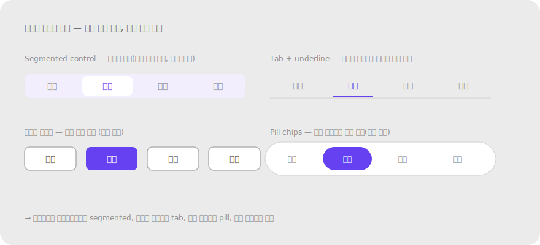
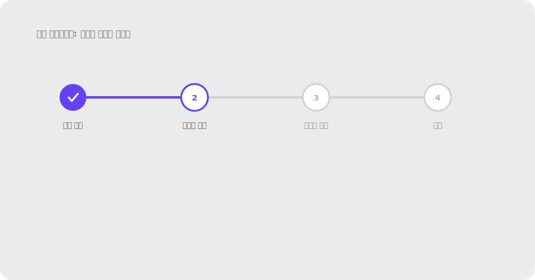

# 2.4 연결성 Uniform Connectedness

**정의** — 선·막대 등으로 물리적으로 연결된 요소들은 한 그룹으로 지각된다. 근접성·유사성의 차이를 덮을 만큼 강하다.

> 떨어진 두 요소를 선으로 연결한 버전 vs 안 한 버전. 색/거리가 달라도 연결선이 묶음을 만든다.

**왜 (인지 원리)**

- Palmer & Rock (1994)이 정립. **모든 그룹핑 단서 중 가장 강력**한 신호 — 근접성·유사성·심지어 공통 영역과 충돌해도 보통 이긴다.
- 시각 시스템은 물리적으로 이어진 영역을 "같은 객체"의 일부로 강하게 추정한다. 진화적으로 자연계의 윤곽선이 연속적이라는 통계 규칙성에서 비롯된 것으로 본다.
- 연결성의 종류: ① **명시적 선**(stepper의 화살표) ② **공유 경계**(인접한 셀) ③ **연속된 영역**(segmented control의 한 막대) — 모두 같은 효과지만 시각 무게는 다름.
- 임계 조건 — 연결선이 너무 가늘면(1px 이하) 그룹 신호가 약함. 너무 굵으면(>4px) 선 자체가 figure가 되어 콘텐츠와 경쟁.
- **잘못 연결된 신호의 위험성** — 의도치 않은 가로선(예: 카드 사이의 divider)이 두 카드를 묶을 수 있음. 사용자는 "이 둘이 관련 있다"고 잘못 해석.

**현장 적용 패턴**

*단계·진행 인디케이터*

- Multi-step 폼/체크아웃: 단계 원들을 선으로 이어 "하나의 흐름"임을 표시. 완료된 단계는 채움 색으로 진행 정도 표시.
- 수직 stepper(좌측 사이드): 단계 사이 세로선. 모바일에 적합.
- progress bar: 단계가 아니라 연속 비율일 때.
- 체크리스트 진행: 각 항목 앞 원 + 연결선 → 하나의 task 묶음.

*컨트롤 그룹*

- Segmented control: 옵션들이 한 막대(rounded rectangle)에 붙어 "상호 배타적 선택"임을 시각화.
- Toggle button group(굵게/기울임/밑줄): 인접해 붙은 버튼 그룹 — 같은 종류의 토글이라는 신호.
- 페이지네이션: 페이지 번호들이 한 줄 컨테이너 안에서 인접 → 같은 페이지 집합.
- Tabs: 탭들이 한 가로선 위에 인접 + active 탭 밑줄로 현재 위치 강조.

> 
> *연결성 컨트롤 변형 — segmented / tab / pill / 분리 버튼*

*내비게이션·계층 구조*

- 브레드크럼: ">" 또는 "/" 구분자로 시각적 연결 — 계층 경로 표시.
- 트리 뷰(file explorer): 들여쓰기 + 점선/실선으로 부모-자식 연결.
- 네비게이션 화살표: "이전"·"다음" 버튼이 다음 단계를 가리키며 이어짐을 암시.

*관계 시각화*

- 노드-엣지 다이어그램: 플로우차트, 마인드맵, 조직도.
- Gantt 차트: task 간 의존 화살표.
- 연결선이 시점-종점이 분명해야 함 — 화살표 머리, 색, 굵기로 방향성·강도 표현.

*데이터 시각화*

- Line chart: 점들을 잇는 선이 시계열 흐름을 표현. 점만 있으면 무관해 보임.
- Sankey diagram: 흐름의 양을 폭으로 표현하며 출발지-목적지 연결.
- Network graph: 노드 간 관계의 강도를 선 굵기·색으로 표현.

*대화·스레드*

- 댓글 스레드의 좌측 들여쓰기 + 세로선: 부모-자식 관계 표시.
- 메신저 말풍선 그룹: 같은 발신자의 연속 메시지를 시각적으로 묶음(꼬리 모양·색).

*데이터 입력*

- Range slider 양쪽 핸들 + 사이 채워진 막대: 두 핸들이 한 선택 범위.
- 연결된 입력(예: from–to 날짜): 두 필드 사이를 시각적으로 잇는 아이콘(→) 또는 한 행에 배치.

**다른 법칙과의 상호작용**

- **모든 단서를 압도**: 색·모양·거리 차이를 다 덮음. 가장 강력한 그룹 신호.
- **공통 영역과 경쟁**: 박스 안과 박스 밖을 잇는 연결선은 박스의 닫힘을 부분적으로 깨뜨림.
- **의도치 않은 연결**: divider, 표 안 가로선이 무관한 행을 묶는 사고가 흔함. 시각적 선이 의미적 그룹과 일치하는지 확인 필수.
- **연속성과 결합**: 연결선의 곡률·방향이 매끄러우면(연속성) 그룹화 신호가 더 안정적.

> **예시 데모** — [SVG 미리보기](../assets/examples/02-4-connectedness-stepper.svg) · [HTML 데모](../assets/examples/02-4-connectedness-stepper.html)
>
> 

**레퍼런스**

- NN/g (영상) — Connectedness: https://www.nngroup.com/videos/connectedness-gestalt/
- Palmer, S. & Rock, I. (1994). Rethinking perceptual organization: The role of uniform connectedness. *Psychonomic Bulletin & Review*.
- IxDF — Part 2 (Uniform Connectedness 포함): https://www.interaction-design.org/literature/article/laws-of-proximity-uniform-connectedness-and-continuation-gestalt-principles-2

**체크리스트**

- [ ] 흐름·순서·관계를 표현하는 곳에 연결선·인접 컨테이너를 활용했는가?
- [ ] 의도치 않은 가로선/세로선이 무관한 요소를 묶고 있지 않은가?
- [ ] 연결선의 굵기·색이 콘텐츠와 경쟁할 만큼 강하지 않은가? (1.5–2px가 보통 안전)
- [ ] segmented control vs 분리된 버튼 — 의미적으로 상호배타적이면 segmented가 맞는 선택인가?
- [ ] 단계 인디케이터에서 완료/진행중/대기 상태가 색·모양으로 구분되는가?

---
