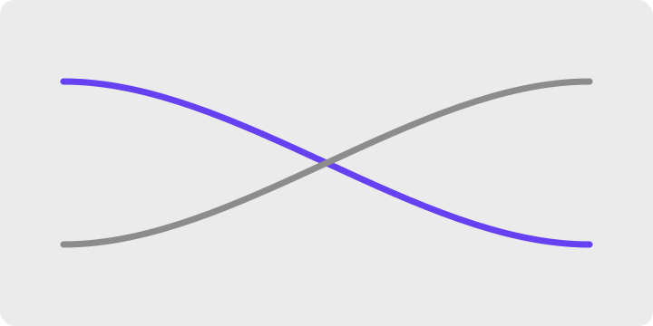
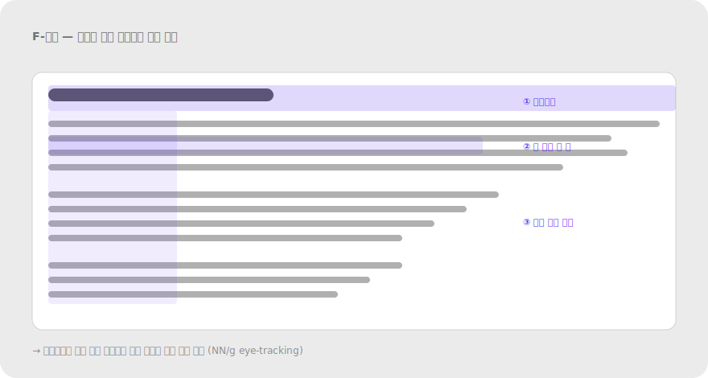

# 2.5 연속성 Continuity / Good Continuation

**정의** — 눈은 선과 곡선을 따라 자연스럽게 이어서 지각한다. 정렬되어 한 방향으로 흐르는 요소들을 한 그룹·한 경로로 본다.

> 일렬로 정렬된 요소들이 하나의 경로로 읽히는 예시, 또는 두 선이 교차할 때 꺾이기보다 매끄럽게 이어 보이는 예시.

**왜 (인지 원리)**

- 시각 시스템은 급격한 방향 전환보다 **매끄러운 연속**을 선호한다(Wertheimer, 1923). 두 선이 교차할 때 90도 꺾어서 보지 않고 두 개의 부드러운 곡선으로 본다.
- **시선 경로 형성** — 정렬된 요소들은 자동으로 시선의 "트랙"을 만든다. 좌측 정렬된 텍스트의 왼쪽 가장자리, 그리드의 격자선, 수직 정렬된 CTA 모두 동일 원리.
- **읽기 패턴(F·Z·layer-cake)**은 연속성의 응용 — F-패턴은 시선이 텍스트 라인을 따라 수평으로 흐르다 좌측 정렬축을 따라 수직 하강. Z-패턴은 시각 요소가 많을 때 헤더→히어로→CTA로 대각선 흐름.
- **잘 정렬된 그리드**가 신뢰감을 주는 이유는 시선 경로가 매끄러워 인지 부하가 낮기 때문. 금융·정부 서비스에서 그리드 일관성이 특히 중요한 이유.
- 연속성이 깨질 때: ① 정렬축이 약간씩 어긋남(2–4px) — 명시적 잘못보다 더 불쾌, 잠재의식적 불안 ② 곡선이 부드럽지 않은 베지에 곡선 ③ 텍스트 줄바꿈이 불규칙(rag).

**현장 적용 패턴**

*정렬·그리드 시스템*

- 8pt 또는 4pt 스페이싱 시스템: 모든 여백·요소 크기를 8(또는 4)의 배수로 → 자동으로 정렬되어 시선 흐름 매끄러움.
- 컬럼 그리드(12/16-col): 모든 콘텐츠가 같은 컬럼 폭에 정렬 → 페이지를 스크롤할 때 시선 축이 흔들리지 않음.
- 좌측 정렬 라벨 + 좌측 정렬 인풋 → 폼 전체가 한 수직선으로 읽힘.
- 리스트 아이콘들이 같은 수직선에 정렬 → 텍스트도 같은 수직선 → 두 트랙이 평행해 시선이 부드럽게 내려감.

*스캔 패턴 활용*

- 텍스트 중심 페이지: F-패턴 — 상단 헤드라인 + 좌측에 핵심 정보 배치(처음 두 단어가 가장 많이 읽힘).
- 시각 중심 페이지: Z-패턴 — 로고(좌상) → 메뉴(우상) → 히어로 이미지/CTA(좌하/우하) 대각선 흐름.
- 레이어케이크 패턴(가로 폭이 큰 페이지): 가로 띠가 위에서 아래로 쌓이는 구조 — 각 띠는 단일 메시지.

> 
> *F-패턴 시선 동선 — 헤드라인 + 좌측 트랙*

*스크롤·페이지 흐름*

- Carousel/슬라이더: 다음 카드를 24–40px peek로 자르기 → "옆으로 더 있음" 경로 암시.
- 무한 스크롤: 페이지 끝에 옅은 로딩 스피너 → 콘텐츠 흐름이 "끊기지 않음" 신호.
- 스크롤 시 sticky 헤더가 자연스럽게 따라옴 → 시선 기준점이 유지됨.

*내비게이션·읽기 동선*

- 리스트의 행 사이 미세한 hover line(1px) → 마우스 위치를 잃지 않게 가이드.
- 읽기 진행률 바(article progress bar): 페이지 상단 고정 — 현재 위치를 연속적으로 표시.
- 사이드바 active item에서 메인 콘텐츠로 연결되는 시각 흐름(예: 활성 메뉴 색 = 메인 헤더 색).

*차트·데이터 시각화*

- Line chart의 부드러운 곡선(monotone interpolation) — 시계열의 흐름을 직관적으로 전달.
- 축 눈금이 일정한 간격(linear scale 또는 log scale 명시) → 곡선의 의미가 일관.
- 범례 색-라인 위치 정렬: 차트 위 라인 끝 = 범례 색의 위치 매핑.

*마이크로 정렬*

- 아이콘과 텍스트의 baseline 정렬 — 아이콘이 텍스트의 가운데에 시각적으로 맞아야(geometric center ≠ optical center 주의).
- 버튼 안 텍스트는 정확히 가운데 — 위/아래 패딩 비대칭이면 글자가 "기울어진" 느낌.
- 단위(₩·%)와 숫자 사이 0px 또는 일관 간격.

*애니메이션 경로*

- 요소 이동 경로가 일직선 또는 부드러운 곡선 — 갑작스러운 방향 전환은 시선이 따라가지 못함.
- Magic move / shared element transition: 같은 요소가 화면 간에 연속해서 이동(iOS Photos 앱).
- easing 곡선: ease-in-out가 자연스럽고, linear는 기계적이라 거리감.

**다른 법칙과의 상호작용**

- **근접성·유사성과 결합**: 잘 정렬된 + 비슷한 요소는 강한 연속 경로 형성.
- **공동운명과 결합**: 연속된 경로를 따라 같이 움직이면 흐름 신호 ↑↑.
- **잘못 정렬되면 모든 신호 약화** — 2–4px 어긋남은 명시적 오류보다 더 거슬리는 잠재의식 부담.

> **예시 데모** — [SVG 미리보기](../assets/examples/02-5-continuity-carousel.svg) · [HTML 데모](../assets/examples/02-5-continuity-carousel.html)
>
> 

**레퍼런스**

- NN/g (영상) — Continuation: https://www.nngroup.com/videos/continuation-gestalt/
- NN/g — F-Shaped Pattern of Reading on the Web: https://www.nngroup.com/articles/f-shaped-pattern-reading-web-content/
- IxDF — Part 2: https://www.interaction-design.org/literature/article/laws-of-proximity-uniform-connectedness-and-continuation-gestalt-principles-2
- Material Design — Layout grid: https://m3.material.io/foundations/layout/applying-layout/window-size-classes

**체크리스트**

- [ ] 모든 요소가 명확한 그리드 축(4/8pt)에 정렬되어 있는가?
- [ ] 폼 라벨·인풋·CTA가 같은 수직선을 따라 흐르는가?
- [ ] 캐러셀/스크롤에서 "더 있음"을 시각적으로 암시하는가? (peek, fade)
- [ ] 스캔 패턴(F/Z)을 고려해 핵심 정보를 첫 시선 지점에 두었는가?
- [ ] 아이콘과 텍스트의 baseline·optical center가 정렬됐는가?
- [ ] 애니메이션 경로가 부드러운 곡선·일직선이고 갑작스러운 꺾임이 없는가?

---
