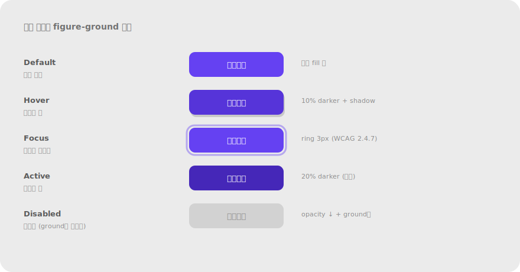
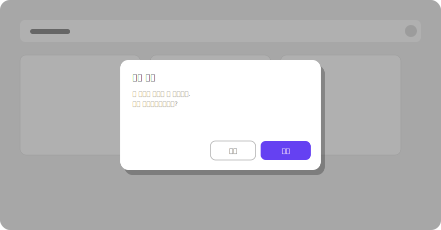

# 2.7 전경-배경 Figure/Ground

**정의** — 사람은 장면을 전경(figure, 주목 대상)과 배경(ground)으로 나누고, 전경에 지각을 집중한다.

> 루빈의 꽃병(얼굴/꽃병) 또는 모달 다이얼로그가 어두운 오버레이 위로 떠오르는 화면.

**왜 (인지 원리)**

- Rubin (1915)의 꽃병-얼굴 실험이 원전 — 시각 시스템은 장면을 자극 입력 후 약 **80–150ms 안에** 전경(figure)과 배경(ground)으로 가른다.
- **figure 결정 단서**(약→강): ① 작은 영역이 figure 경향 ② 둘러싸인 영역 ③ 대칭적·규칙적 모양 ④ 의미 있는 형태(얼굴·문자) ⑤ **명도·색 대비**(가장 강력) ⑥ **그림자/depth 단서**.
- **한 번에 하나의 해석에만 집중** — 루빈의 꽃병에서 사용자는 동시에 둘을 못 보고 번갈아 본다. UI에서도 "전경이 명확하지 않으면 사용자가 어디를 봐야 할지 갈팡질팡".
- WCAG **명도 대비 비율** 권장(전경:배경): 일반 텍스트 4.5:1, 큰 텍스트 3:1, UI 컴포넌트·아이콘 3:1. 이게 곧 전경-배경 분리 신호.
- **figure 과잉의 함정**: 한 화면에 강한 figure가 3개 이상이면 모두 평등해져 전경 신호 소실 → "전부 강조 = 강조 없음" 안티패턴.

**현장 적용 패턴**

*모달·오버레이*

- 모달: scrim(반투명 검정 50–60% opacity) + 카드 elevation 16–24dp + 그림자 → 카드가 강한 figure.
- Bottom sheet: 부분 scrim 또는 핸들로 "주 화면 위에 띄워짐" 신호.
- Popover/Tooltip: 작은 그림자 + 화살표로 트리거에 연결된 figure.
- Notification banner: 페이지 상단에 색 배경 띠 — 시스템 수준 figure.
- Toast: 화면 한쪽에 elevation 카드.

*CTA·강조*

- 주요 CTA: 채움 색(액센트) + 충분한 여백 + (선택) drop shadow → 다른 모든 UI보다 figure로 떠오름.
- 한 화면에 강한 figure는 1–2개로 절제 — 3개 이상이면 시선이 분산되고 "모두 강조 = 강조 없음".
- 배경에서 figure를 띄우는 방법: 색 대비 > 크기 > 위치(중앙) > 그림자.

*상태 표시*

- 활성/선택된 상태: 배경 tint + 강한 색 텍스트 + (옵션) 좌측 색 바 → 다른 항목들과 figure-ground 분리.
- 비활성(disabled): opacity 40–50% → 배경으로 물러남(ground화).
- Loading 상태: 컨테이너 자체를 옅게 + spinner 또는 skeleton 표시.
- Error 상태: 빨강 + 굵은 텍스트 — figure로 강하게 떠오르도록.

*가독성 (배경 이미지 위 텍스트)*

- 히어로 이미지 + 텍스트 — **그라디언트 scrim** 필수. 텍스트가 위치할 영역에 검정 0–70% 그라디언트.
- Frosted glass(backdrop-filter blur): 텍스트 뒤만 흐려서 figure 보강 (iOS·macOS 스타일).
- 텍스트 자체에 text-shadow — 미세하게 어두운 그림자로 가장자리 분리.
- 글자 외곽선(stroke) — 최후 수단, 가독성 떨어질 수 있음.

*계층 구조 (depth)*

- Elevation 시스템(0/1/3/8/16dp): 위계가 곧 figure-ground 단계. 0=배경, 16=모달.
- z-index 명시적 관리: 모든 floating UI(드롭다운·툴팁·모달)의 z-index를 토큰으로 관리.
- 활성 윈도우(여러 패널 중) 강조: 비활성 패널을 옅게(opacity 70–80%).

*Focus·Hover 상태*

- Focus ring: 키보드 접근성 — 2–3px 두께 + 액센트 색. WCAG 2.4.7 준수.
- Hover: 배경색 tint 또는 elevation 상승 → 상호작용 가능한 figure 강조.
- Active(pressed): 색 더 진하게 + (옵션) 미세한 scale 감소 → 누르는 감각.

> 
> *버튼 상태별 figure-ground — default/hover/focus/active/disabled*

*카드·콘텐츠 영역*

- 카드 elevation: shadow + 약간의 색 차이(흰 카드 + 옅은 회색 배경).
- Sidebar vs main: 메인 영역이 figure, 사이드바는 ground(더 옅은 배경 또는 다른 색).
- Sticky header: 스크롤 시 그림자 추가 → 콘텐츠 위에 떠 있음을 강조.

**다른 법칙과의 상호작용**

- **모든 그룹핑 단서와 결합**: figure 안의 요소들은 더 강하게 묶임.
- **대비가 핵심 단서**: 색·명도·크기·shadow 대비가 강할수록 figure-ground 분리 강력.
- **과잉은 안티패턴(§5.4)** — 모든 것이 figure면 전경 신호 소실.
- **접근성 의무**: WCAG 명도 대비 비율 충족이 곧 figure-ground 분리의 정량 기준.

> **예시 데모** — [SVG 미리보기](../assets/examples/02-7-figure-ground-modal.svg) · [HTML 데모](../assets/examples/02-7-figure-ground-modal.html)
>
> 

**레퍼런스**

- NN/g (영상) — Figure/Ground: https://www.nngroup.com/videos/figure-ground-gestalt/
- Rubin, E. (1915). Visuell wahrgenommene Figuren — 원전.
- WCAG 2.2 — Contrast (Minimum) 1.4.3: https://www.w3.org/WAI/WCAG22/Understanding/contrast-minimum
- Material Design — Elevation: https://m3.material.io/styles/elevation/overview
- Apple HIG — Materials & Vibrancy: https://developer.apple.com/design/human-interface-guidelines/materials

**체크리스트**

- [ ] 사용자가 "지금 봐야 할 것(전경)"이 분명한가?
- [ ] 한 화면에 강한 figure가 1–2개로 절제됐는가?
- [ ] 배경 이미지 위 텍스트 대비가 WCAG 4.5:1 이상인가?
- [ ] 활성/비활성/hover/focus 상태가 명확히 figure-ground로 구분되는가?
- [ ] 모달·시트의 scrim + elevation이 충분히 강한가?
- [ ] Focus ring이 키보드 사용자에게 명확히 보이는가?

---
