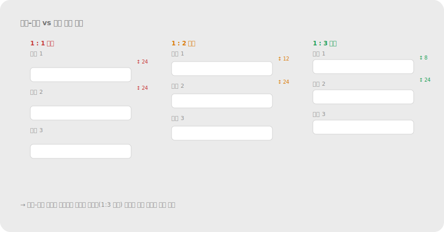
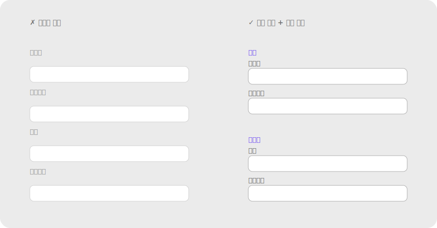

# 2.1 근접성 Proximity

**정의** — 서로 가까이 있는 요소들은 한 그룹으로 지각된다. 멀리 떨어진 요소들은 다른 역할을 하는 것으로 본다.

> 같은 점 9개를 ① 균등 배치 ② 3개씩 가깝게 배치한 두 버전. 같은 요소인데 간격만으로 묶임이 달라진다.

**왜 (인지 원리)**

- 시각 시스템은 자극 제시 후 약 **150–200ms** 안에 그룹핑을 완료한다(Han & Humphreys, 1999). 사용자가 라벨을 "읽기 전"에 이미 어느 필드 소속인지 결정된다는 뜻이다.
- 근접성은 일종의 **베이지안 사전 추정**이다. 자연계에서 공간적으로 가까운 요소는 같은 객체일 확률이 높다는 통계적 규칙성을 시각 시스템이 학습한 결과로 본다(Geisler, 2008).
- **클러스터 임계비(cluster ratio)** — 그룹 내부 간격이 그룹 사이 간격의 **약 1/2 이하**일 때 묶음이 안정적으로 지각된다. 1/2~2/3 구간은 모호, 2/3 초과면 그룹이 풀린다.
- 다른 그룹핑 단서와 충돌할 때 — 근접성은 **색·모양·크기·방향을 자주 압도**하지만, **공통 영역(테두리·배경)·연결성(명시적 선)에는 진다**(Palmer & Rock, 1994).
- 작동이 깨지는 조건: ① 그룹 내부 ≈ 그룹 사이 간격(모호), ② 회전·기울어진 텍스트(읽기 축이 우선해 시각 거리 인식이 왜곡), ③ 시선이 이미 한 곳에 고정된 상태(주변시야에서 근접성이 약화).

**현장 적용 패턴**

*폼·입력*

- 라벨 ↔ 필드: 4–8px (긴밀하게 묶임). 다음 필드 라벨까지: 16–24px. **두 간격의 비율 1:3 이상**을 만들어야 라벨이 자기 필드에 명백히 속함.
- 인라인 에러 메시지: 해당 필드 아래 ≤8px. 다음 필드 라벨보다 명백히 가까워야 "어느 필드 에러인지" 즉시 인지.
- 헬프 텍스트: 필드 아래 4px(필드의 부속물)·다음 필드까지 20px 이상. 헬프와 다음 라벨 간격 비율 1:4 이상 권장.
- 폼 섹션 헤더: 위 32–48px(섹션 분리)·아래 16–24px(자기 섹션 결합). 위:아래 비율 ≥ 2:1.
- 라디오/체크박스 그룹: 옵션 간 8px(그룹 내), 그룹 간 24px+ (그룹 사이). 옵션 라벨이 다음 그룹의 첫 옵션과 같은 거리면 시각적 그룹이 깨짐.
- 좌측 라벨(label-on-left) 폼: 라벨-필드 수평 간격이 행간보다 좁아야 함. 행간보다 넓으면 라벨이 위 행 필드로 묶임.
- multi-step 폼: 진행 인디케이터 단계 명과 단계 번호는 4px(같은 단위), 단계 사이는 32px+(시간적 순서 구분).

> 
> *근접성 비율 가이드 — 라벨↔필드 vs 행간 1:3 이상*

*카드·리스트*

- 카드 내부 패딩 16–24px < 카드 간 gap 24–32px → **테두리 없이도 그룹 형성**. 내부 패딩 > 카드 간 gap이면 카드가 한 덩어리로 보임.
- 리스트 아이템: 메타(아바타·아이콘+텍스트) 내부 8px, 아이템 사이 12–16px, 카테고리 헤더와 첫 아이템 8px.
- 그리드 카드: 가로 = 세로 간격(같은 그리드 리듬)으로 시각 무게가 안정. 가로 ≠ 세로면 한쪽으로 기울어 보임.
- 복잡한 카드(헤더 + 본문 + 푸터): 헤더-본문 16px / 본문-푸터 16px / 푸터-카드 끝 16px(내부 일관). 카드 사이는 그 두 배.

*내비게이션*

- 메뉴 그룹 헤더 ↔ 첫 항목 4–8px, 그룹 사이 16–24px. macOS Finder 사이드바·Spotify 좌측 메뉴가 대표적.
- 메가메뉴: 컬럼 간 32–48px(섹션 분리), 컬럼 내 그룹 라벨과 항목 8px. 컬럼 간격이 너무 좁으면 컬럼이 하나로 섞임.
- 하단 탭바: 아이콘 ↔ 라벨 4px(같은 단위로 묶임), 탭 사이 자동 균등. 아이콘만/라벨만으로 분리되면 안 됨.
- 브레드크럼: 항목과 구분자(/) 사이 4–6px, 항목 사이는 구분자 + 양옆 여백.

*데이터·차트*

- 차트 축 라벨 ↔ 축선: 4–6px. 차트 간격은 24–32px(그래프끼리 분리).
- 표(table): 헤더 ↔ 첫 행 8px / 행 간 4–8px(밀집형) 또는 12–16px(여유형). **그룹 행 분리**는 16–24px(시각적 sub-heading 역할).
- 범례(legend): 색상 칩 ↔ 라벨 6–8px(한 항목), 항목 간 16–24px.
- 대시보드 KPI 카드: 같은 도메인(예: 매출 관련) 끼리 가까이, 다른 도메인(트래픽 vs 매출)은 더 멀게.

*모바일·터치*

- 작은 화면에서 그룹 간격을 비례 축소하지 말 것 — **절대값(예: 16px) 유지**가 가독성 확보.
- 터치 타겟 최소 44×44pt(Apple HIG) / 48×48dp(Material) — 시각적 그룹은 좁아도 히트 영역은 보장.
- 바텀 시트: 핸들과 콘텐츠 사이 12px+. 핸들이 콘텐츠의 일부로 오해되지 않게.
- 스와이프 카드 캐러셀: 카드 가장자리에서 다음 카드 peek 24–40px (연속성 신호와 결합).

*마이크로카피·인라인 요소*

- 체크박스 ↔ 라벨 8px → 라벨 클릭도 토글되는 영역이라고 인지.
- 단가 ↔ 통화 기호 0–2px(같은 단위), 단가 ↔ 부가세 8px(별개 정보), 합계는 24px+ 띄움.
- 아이콘 + 텍스트 버튼: 아이콘 ↔ 텍스트 6–8px. 버튼 사이는 16–24px.
- 툴팁: 트리거에서 8–12px 떨어져 표시 — 너무 가까우면 트리거 가림, 너무 멀면 어느 요소의 툴팁인지 모름.

*모션·트랜지션*

- 펼침/접힘 시 영향 영역만 함께 움직여야 함. 무관한 주변 요소가 같이 흔들리면 잘못된 그룹 형성.
- 새 항목 등장 시 같은 그룹 안에서만 페이드·슬라이드. 그룹 경계를 넘는 트랜지션은 그룹 신호 깨짐.
- drag-and-drop: 드래그 중인 요소가 호버한 영역의 다른 요소와 8px 이내로 근접하면 그 그룹에 편입되는 시각 신호.

**다른 법칙과의 상호작용**

- **압도(이김)**: 색·모양·크기·방향 단서 — 근접하면 다른 시각 속성이 달라도 묶임.
- **밀림(짐)**: 공통 영역(테두리·배경)·연결성(명시적 선) — 박스나 선이 있으면 근접성을 뒤집어 멀리 떨어진 요소도 묶을 수 있음.
- **우선순위 (Palmer & Rock, 1994)**: 공통 영역 > 연결성 > 근접성 > 유사성. 폼에서 라벨-필드 묶기에 근접성으로 충분하지 않으면 fieldset 박스(공통 영역) 추가가 다음 단계.
- **유사성과 결합**: 같은 색 + 가까운 거리 = 매우 강한 그룹. 반대로 다른 색이라도 가까우면 보통 근접성이 이김.

> **예시 데모** — [SVG 미리보기](../assets/examples/02-1-proximity-form.svg) · [HTML 데모](../assets/examples/02-1-proximity-form.html)
>
> 

**레퍼런스**

- NN/g — Proximity Principle in Visual Design: https://www.nngroup.com/articles/gestalt-proximity/
- NN/g (영상) — Proximity: Gestalt Principle for UI Design: https://www.nngroup.com/videos/proximity-gestalt/
- IxDF — Gestalt Principles (Part 2): https://www.interaction-design.org/literature/article/laws-of-proximity-uniform-connectedness-and-continuation-gestalt-principles-2
- Palmer, S. & Rock, I. (1994). Rethinking perceptual organization: The role of uniform connectedness. *Psychonomic Bulletin & Review* — 그룹핑 단서 우선순위 실험.
- Han, S. & Humphreys, G. W. (1999). Interactions between perceptual organization based on Gestalt laws and those based on hierarchical processing. *Perception & Psychophysics*.

**체크리스트**

- [ ] 그룹 내부 간격이 그룹 사이 간격의 1/2 이하인가? (클러스터 임계비)
- [ ] 라벨이 자기 필드와 다음 필드 어느 쪽에 더 가까운가? 라벨-필드 비율 1:3 이상?
- [ ] 인라인 에러가 다음 필드 라벨보다 자기 필드에 명백히 가까운가?
- [ ] 헬프 텍스트와 다음 필드 라벨 간격 비율 1:4 이상?
- [ ] 카드 내부 패딩 < 카드 사이 간격?
- [ ] 그리드 카드의 가로 간격 = 세로 간격인가?
- [ ] 모바일에서 절대 간격(px·dp)을 유지하고 비례 축소하지 않았나?
- [ ] 터치 타겟 44pt/48dp 확보(시각 그룹은 좁아도 OK)?
- [ ] 다른 단서(색·모양·박스·선)와 충돌할 때 의도한 그룹이 우세한가?

---
