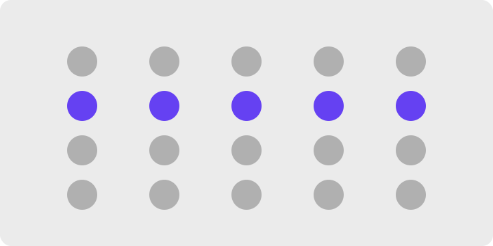
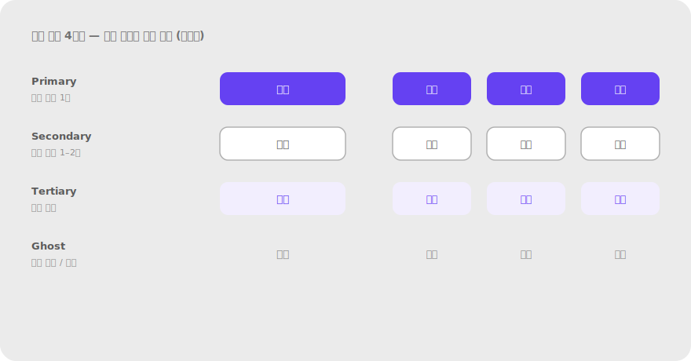
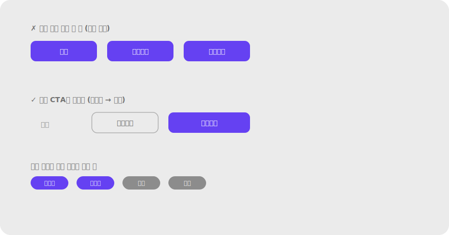

# 2.2 유사성 Similarity

**정의** — 색·모양·크기·방향 등 시각 특성을 공유하는 요소들은 서로 관련된 것으로 지각된다. 달라 보이는 요소는 다른 그룹으로 본다.

> 격자로 배열된 점들에서 한 줄(또는 한 열)만 색을 다르게 → 배치와 무관하게 색으로 묶여 보이는 예시.

**왜 (인지 원리)**

- 시각 특성(색·모양·크기·방향·텍스처) 중 **단 하나만 공유**해도 그룹이 형성된다. 단, 공유 특성의 차이가 **JND(just-noticeable difference)** 이상이어야 작동 — 두 색상의 ΔE가 1–2 이하면 시각 시스템이 동일하다고 처리.
- **특성별 그룹핑 강도(약 → 강)**: 방향 < 크기 < 모양 < 색 < 명도(luminance). 명도 차이가 가장 강력하므로 흑백 인쇄에서도 그룹이 유지되려면 명도 대비를 같이 설계해야 한다.
- **색 우선(color popout)** 효과: 색만 다른 항목은 100ms 이내에 "튀어나와" 보인다(Treisman, 1985). 그래서 **주요 CTA를 색으로 차별화하면 사용자가 사실상 즉시 발견**한다.
- 유사성이 깨지는 조건: ① 너무 많은 특성을 동시에 변주(색+모양+크기) → 각 특성의 그룹화 신호가 상쇄, ② 색맹/명도 비대응 → 색만으로 그룹화하면 8% 남성 사용자에서 신호 손실, ③ 다크모드/라이트모드 전환 시 동일 색의 의미가 달라짐.
- 접근성과 결합 — WCAG 1.4.1 "색만으로 정보 전달 금지" 조항은 유사성 원칙을 색으로만 적용하면 실패함을 명문화. 색 + 아이콘 + 라벨 등 **이중 부호화(redundant coding)** 권장.

**현장 적용 패턴**

*버튼 위계*

- Primary CTA 1개만 액센트 색(채움). Secondary는 outline, Tertiary는 ghost(텍스트만). 한 화면에 채움 버튼이 2개 이상이면 위계 소실.
- 같은 역할의 버튼은 같은 스타일 유지 — "확인" 버튼이 화면마다 모양/색이 다르면 학습 비용 ↑.
- 파괴적(destructive) 액션은 별도 색군(빨강 계열) 일관 적용. "삭제"가 일반 회색이면 위계가 약함.
- 아이콘 버튼 그룹: 모든 아이콘 스타일 통일(filled vs outlined 섞지 말 것). Material 가이드도 한 화면에서 한 스타일.

> 
> *버튼 위계 4단계 — Primary / Secondary / Tertiary / Ghost*

*상태·카테고리 색*

- 상태 의미 색은 시스템 전체에서 1:1 매핑 — 성공=초록, 경고=호박, 에러=빨강, 정보=파랑. 한 곳에서 어긋나면 학습 가치 손실.
- 카테고리 태그: 도메인별 색 1개로 고정. "결제" 관련 태그는 늘 같은 색. 동의어 색을 다양화하면 카테고리 인지 실패.
- 바뀐 상태 표시(dot/badge): 같은 종류의 알림은 같은 색·크기·위치.

*타이포그래피*

- 같은 역할의 텍스트는 정확히 같은 스타일(폰트·크기·웨이트·색) — H2는 어디서나 같은 H2.
- 본문에서 강조하려고 임의의 폰트/색을 쓰면 위계 붕괴. 강조는 **bold/italic/underline** 중 1가지만 통일.
- 링크 스타일: 색 + 밑줄(또는 hover 시 밑줄) — 일반 텍스트와 구분되는 단 하나의 시각 차이를 정해 모든 링크에 적용.

*아이콘·일러스트*

- 아이콘 시스템: line 또는 filled 한 스타일 선택해 전체 통일. 두께(stroke weight) 1.5px/2px도 통일.
- 빈 상태(empty state) 일러스트: 같은 스타일·팔레트 — 한 곳만 사진이고 다른 곳이 일러스트면 부분만 떠보임.
- 아바타 모양: 원 또는 사각형 중 한 시스템 — 섞으면 사용자 그룹/조직 그룹 같은 카테고리 차이로 오해.

*카드·리스트 패턴*

- 같은 종류의 카드는 같은 구조(이미지 위치·메타 위치·CTA 위치)·같은 비율. 뉴스 카드는 뉴스 카드끼리, 상품 카드는 상품 카드끼리.
- 카드 그림자/elevation: 같은 위계의 요소는 같은 elevation. 5dp/8dp가 섞이면 깊이 위계가 깨짐.
- 카드 hover/active 트랜지션도 통일 — 한 카드만 다른 애니메이션이면 의도된 차이로 오해.

*폼 입력 요소*

- 같은 필드 타입은 같은 모양·크기·패딩. text input과 select가 1px라도 다르면 시선 산만.
- 필수/선택 표시: 모든 필수 필드에 동일 표시(* 또는 "필수" 배지) — 일관되지 않으면 사용자는 "이 별표가 무슨 의미?" 추측.
- 비활성(disabled) 상태: 모든 disabled 요소가 같은 명도/opacity. 한 곳만 진하면 다른 의미로 오해.

*데이터·차트*

- 동일 시리즈는 모든 차트에서 같은 색 — "매출"이 막대차트에서 파랑이면 라인차트에서도 파랑.
- 음수/감소: 일관된 색(예: 빨강) + 일관된 부호(− 또는 ▼). 한쪽만으로 표현하지 말 것.
- 범주 순서: 그래프와 표·범례의 순서를 동일하게 유지 — 순서가 다르면 같은 데이터가 다르게 느껴짐.

*모션·인터랙션*

- 같은 트랜지션 시간·이징: 모든 모달 fade는 200ms ease-out. 한 곳만 300ms면 "더 무거운 화면"으로 오해.
- 같은 인터랙션 패턴: 호버 시 카드가 살짝 떠오르는 효과를 쓴다면 모든 클릭 가능 카드에 일관 적용.

**다른 법칙과의 상호작용**

- **근접성과 결합**: 같은 색 + 가까이 → 매우 강한 그룹. 다른 색 + 가까이는 보통 근접성 우세.
- **근접성에 짐**: 색이 같아도 멀리 떨어지면 같은 그룹으로 즉시 인지되지 않음(거리 부담 큼).
- **공통 영역에 짐**: 같은 카드 안에 있으면 색이 달라도 한 묶음으로 봄.
- **위계와 결합**: 유사성 + 한 곳만 깨기 = 가장 효율적인 강조 기법(예: 회색 버튼 4개 + 액센트 색 1개).

> **예시 데모** — [SVG 미리보기](../assets/examples/02-2-similarity-buttons.svg) · [HTML 데모](../assets/examples/02-2-similarity-buttons.html)
>
> 

**레퍼런스**

- NN/g — Similarity Principle in Visual Design: https://www.nngroup.com/articles/gestalt-similarity/
- NN/g (영상) — Similarity: https://www.nngroup.com/videos/similarity-gestalt-principle/
- Treisman, A. (1985). Preattentive processing in vision. *Computer Vision, Graphics, and Image Processing* — 색 popout 100ms.
- WCAG 2.2 — Use of Color (1.4.1): https://www.w3.org/WAI/WCAG22/Understanding/use-of-color

**체크리스트**

- [ ] 같은 역할의 요소가 모든 화면에서 동일한 시각 스타일인가?
- [ ] 주요 CTA는 색·형태로 보조 버튼과 명확히 구분되는가? 한 화면에 채움 버튼이 1개인가?
- [ ] 상태/카테고리 색이 시스템 전체에서 1:1 매핑인가?
- [ ] 색만으로 의미를 전달하지 않고 아이콘·텍스트로 이중 부호화했는가? (색맹 8% 대응)
- [ ] 아이콘 시스템이 한 가지 스타일(filled vs outlined)로 통일됐는가?
- [ ] 동일 데이터 시리즈가 모든 차트에서 같은 색·순서인가?
- [ ] 같은 종류 카드가 같은 구조·비율·elevation인가?
- [ ] "비슷하게 생겼는데 다른 일을 하는" 요소가 사용자를 헷갈리게 하지 않는가?

---
