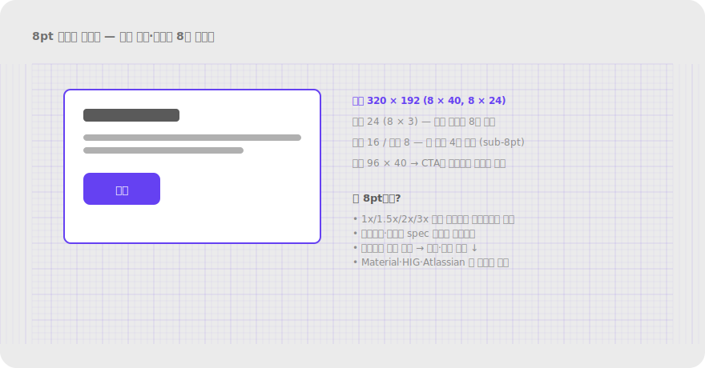
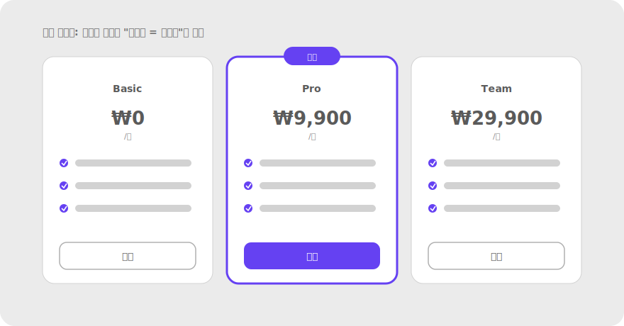

# 2.9 대칭과 질서 Symmetry / Prägnanz

**정의** — 사람은 대상을 가능한 한 단순하고 대칭적인 형태로 지각한다. 떨어져 있어도 대칭을 이루는 요소들을 하나의 정돈된 전체로 본다.

> 대칭 배치된 괄호/요소가 하나의 단위로 묶여 보이는 예시, 또는 균형 잡힌 그리드 레이아웃 한 장.

**왜 (인지 원리)**

- 1장 프레그난츠(단순성)가 형태 차원에서 발현된 모습. 복잡한 배열도 뇌는 "가장 단순하고 균형 잡힌 해석"으로 정리한다.
- **대칭은 시각 무게를 즉시 계산** — 좌우 대칭이면 안정·신뢰·격식. 비대칭은 동적·실험적·캐주얼. 브랜드 톤과 매칭되어야 함.
- **수학적 대칭**(완벽한 거울)은 정적·딱딱함. **광학적 대칭**(시각 무게 균형)은 살아 있는 균형 — 종종 비대칭으로 더 균형감을 줌(예: 큰 사진 옆 작은 텍스트 블록 3개).
- **그리드의 신뢰감** — 일관된 그리드와 정렬은 "정돈됨 = 통제력 = 신뢰감" 신호. 금융·정부·B2B 서비스에서 특히 그리드 일관성이 중요.
- 한계 — 과한 대칭은 단조롭고 위계가 사라짐. 강조해야 할 요소(추천 플랜·주요 CTA)는 의도적으로 대칭을 깨야 figure로 떠오름.

**현장 적용 패턴**

*그리드 시스템*

- 12-column 또는 16-column 그리드: 가장 유연. 1/2, 1/3, 1/4, 1/6 분할 모두 가능.
- Baseline grid(수직 리듬): 모든 텍스트가 일정 간격(예: 4px) 베이스라인에 정렬 → 페이지가 한 음악처럼 흐름.
- Modular scale: 폰트 크기·간격이 수학적 비례(1.125, 1.25, 1.5) → 자동 시각 조화.
- 8pt spacing system: 모든 여백·크기를 8의 배수로 → 자동 그리드 정렬.

> 
> *8pt 그리드 시스템 — 카드·간격·CTA가 모두 8의 배수로 안착*

*레이아웃 균형*

- 대칭 균형: 중심축 좌우가 거울 — 정적·격식. 결혼식 청첩장, 공식 문서.
- 비대칭 균형: 시각 무게가 다른 요소로 균형 — 동적·현대적. 매거진 레이아웃.
- 방사형 균형: 중심에서 바깥으로 — 시계, 차트 일부.
- 시각 무게 계산: 큰 것·진한 것·복잡한 것·따뜻한 색이 무겁다. 작은 액센트 색 하나로 큰 회색 영역과 균형 가능.

*가격표·플랜 비교*

- 3컬럼 대칭 + 중앙 추천 강조: 완벽 대칭에서 한 곳만 깨기 → 추천이 figure로 떠오름.
- 비교 표: 행 정렬(연속성) + 열 폭 통일 → 비교 가능성.
- 추천 컬럼: 살짝 더 크게(scale 1.05) + 색 테두리 + "추천" 뱃지 → 비대칭으로 강조.

*Two-pane / 다단 레이아웃*

- Email/메신저(좌 리스트 + 우 상세): 좌측 1/3 + 우측 2/3 비율이 일반적. 1:1은 정적.
- 대시보드 사이드바: 좁은 고정 폭(240–320px) + 가변 메인.
- 편집기(좌: 파일 트리 + 중: 에디터 + 우: 사이드패널): 3분할.

*카드 그리드*

- 카드 비율 통일(16:9, 4:3, 1:1) — 한 그리드 안에서 한 비율 유지.
- 카드 폭 = 컬럼 폭의 배수 → 자동으로 격자에 맞음.
- 카드 그림자·테두리·라운드 통일 → 시스템 일관성.

*타이포그래피 균형*

- Optical leading(line-height): 본문 1.5–1.6, 제목 1.2–1.3 — 시각적 균형.
- Justification: 양 끝 정렬(justify)은 단어 사이 간격이 들쭉날쭉해서 보통 좌측 정렬 권장.
- 단(column) 폭: 50–75자(영문 기준) — 너무 넓으면 다음 줄 찾기 어려움.
- 제목과 본문 가운데 정렬 vs 좌측 정렬: 짧은 헤드라인은 가운데, 긴 본문은 좌측.

*아이콘·일러스트 균형*

- Optical centering: 기하학적 중심과 시각적 중심이 다름. 삼각형은 기하 중심에 두면 위로 치우쳐 보임 → 살짝 아래로 보정.
- 아이콘 grid(예: 24×24 frame + 20×20 keyline) — 모든 아이콘이 같은 시각 무게.
- Heading + 아이콘 정렬: 글자의 cap-height와 아이콘의 시각 중심을 맞춤.

*단순화 (프레그난츠 응용)*

- 불필요한 장식 제거 — 핵심 구조가 또렷해짐. 미니멀리즘이 신뢰감을 주는 이유.
- 색 팔레트 축소: 1 액센트 + 1 보조 + 회색 5단계 → 위계 명확.
- 폰트 1–2개만 사용 — sans + serif 조합이 흔함.
- 복잡한 차트보다 단순한 막대·선 차트 — 데이터 잉크 비율(Tufte) ↑.

**다른 법칙과의 상호작용**

- **1장 프레그난츠의 응용**: 모든 게슈탈트 법칙이 단순성으로 수렴 — 대칭은 그 시각적 표현.
- **위계와 갈등**: 완벽 대칭은 위계 소실. 강조하려면 의도적으로 대칭을 깨야 함.
- **연속성과 결합**: 정렬된 + 대칭적 = 시선 흐름이 매우 매끄러움.
- **비대칭 균형**: 시각 무게가 다르면 위치·크기로 균형 — 종종 더 흥미로움.

> **예시 데모** — [SVG 미리보기](../assets/examples/02-9-symmetry-pricing.svg) · [HTML 데모](../assets/examples/02-9-symmetry-pricing.html)
>
> 

**레퍼런스**

- IxDF — Part 3 (Prägnanz 포함): https://www.interaction-design.org/literature/article/the-laws-of-figure-ground-praegnanz-closure-and-common-fate-gestalt-principles-3
- Wagemans et al. (2012) Part II — 프레그난츠/단순성 원리: https://www.ncbi.nlm.nih.gov/pmc/articles/PMC3728284/
- Tufte, E. (1983). The Visual Display of Quantitative Information — 데이터 잉크 비율.
- Material Design — Layout grid: https://m3.material.io/foundations/layout/applying-layout/window-size-classes
- 8pt Grid System (Bryn Jackson): https://spec.fm/specifics/8-pt-grid

**체크리스트**

- [ ] 레이아웃이 일관된 그리드(4/8pt)와 정렬을 따르는가?
- [ ] 시각 무게가 좌우 또는 방사로 균형 잡혀 있는가?
- [ ] 강조할 요소(추천 플랜·CTA)는 의도적으로 대칭을 깨서 figure로 떠오르는가?
- [ ] 카드 비율·라운드·shadow·간격이 시스템 토큰으로 통일됐는가?
- [ ] 폰트·색·아이콘 스타일이 1–2가지로 압축됐는가? (프레그난츠)
- [ ] 불필요한 장식 요소가 핵심 구조를 흐리지 않는가?
- [ ] 아이콘의 optical center가 보정됐는가? (특히 삼각형·재생 버튼)

---
